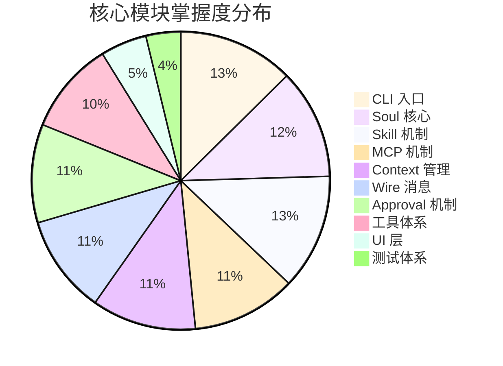
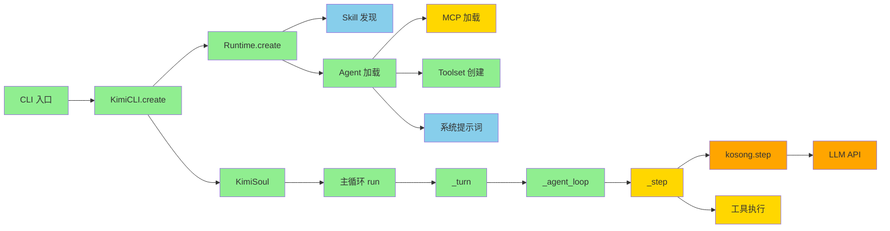
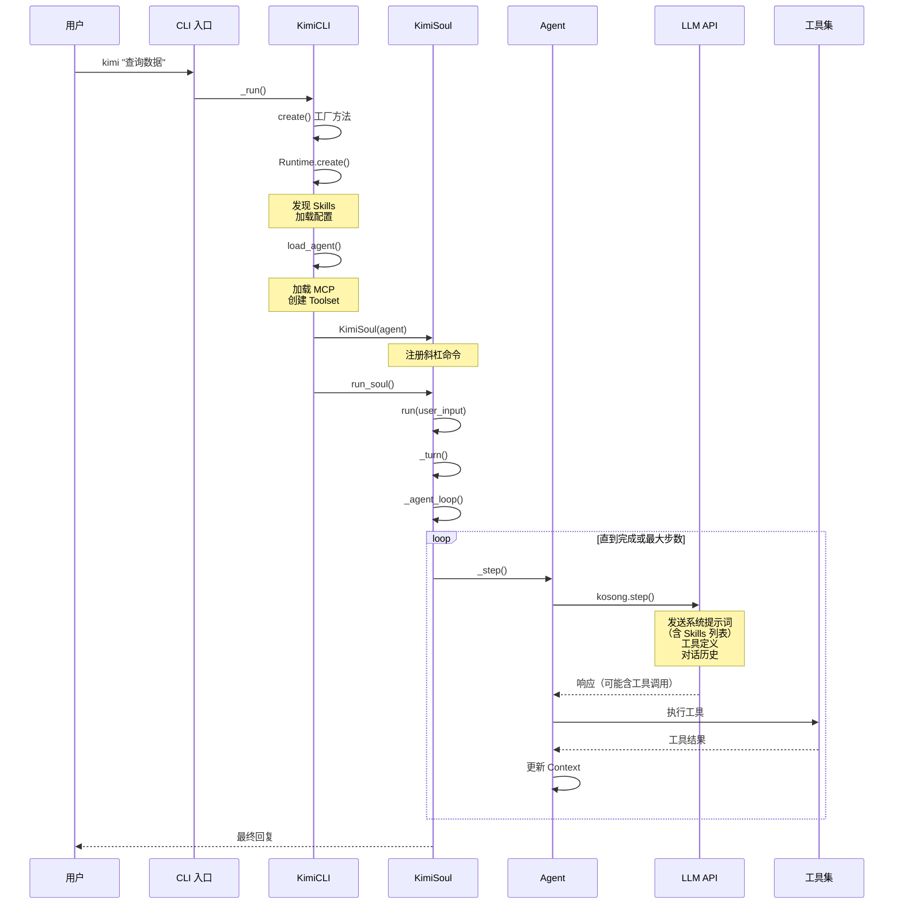
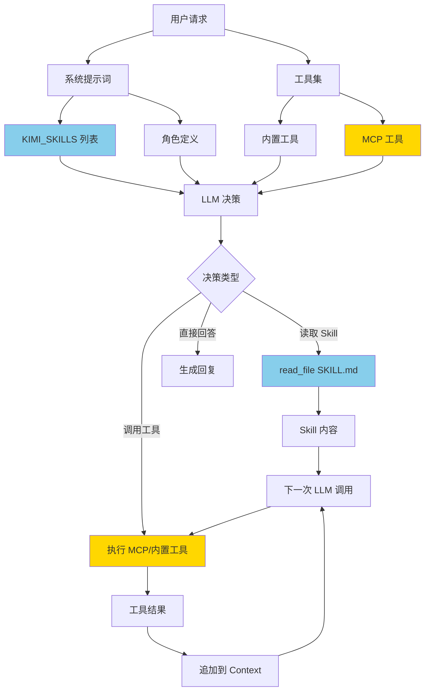
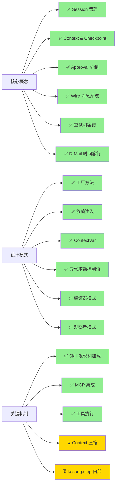

# kimi-cli 学习成果可视化总结

> 生成时间：2026-01-26  
> 总学习时长：6 天  
> 文档产出：220+ KB

---

## 📊 学习进度仪表盘

### 模块掌握度



### 学习路径图



**图例**：
- 🟢 绿色：已完全掌握（90%+）
- 🔵 蓝色：已深入理解（100%）
- 🟡 黄色：基本理解（70-89%）
- 🟠 橙色：待深入（<70%）

---

## 📚 文档体系架构

```mermaid
graph TB
    Root[review_doc/]
    Root --> Debug[debug/]
    Root --> Learn[learn/]
    Root --> Plan[plan/]
    Root --> Check[当前进度检查点]
    
    Debug --> DebugDoc[doc/]
    Debug --> DebugSession[session/]
    
    DebugDoc --> Doc1[00_learning_progress.md<br/>12.6 KB]
    DebugDoc --> Doc2[01_cli_entry_analysis.md<br/>18.0 KB]
    DebugDoc --> Doc3[02_soul_module_analysis.md<br/>30.5 KB]
    DebugDoc --> Doc4[03_print_mode_guide.md<br/>6.2 KB]
    DebugDoc --> Doc5[04_configuration_setup.md<br/>3.6 KB]
    DebugDoc --> Doc6[06_startup_callstack_analysis.md<br/>17.1 KB]
    
    DebugSession --> Session1[session_01_cli_entry.md<br/>2.5 KB]
    DebugSession --> Session2[session_02_soul_module.md<br/>4.9 KB]
    
    Learn --> Learn1[01-整体架构与执行流程梳理.md<br/>10.4 KB]
    Learn --> Learn2[02-Skill加载机制深度解析.md<br/>17.3 KB]
    Learn --> Learn3[03-MCP加载机制深度解析.md<br/>8.3 KB]
    Learn --> Learn4[04-Skill与MCP对比分析.md<br/>19.7 KB]
    Learn --> Learn5[05-MCP工具信息传递.md<br/>15.1 KB]
    Learn --> Learn6[06-重要勘误.md<br/>8.2 KB]
    Learn --> Learn7[07-完整处理机制.md<br/>18.7 KB]
    Learn --> Learn8[08-实战场景-kimi-psql.md<br/>22.6 KB]
    
    style Root fill:#E6F3FF
    style Debug fill:#FFE6E6
    style Learn fill:#E6FFE6
    style Check fill:#FFFFE6
```



---

## 🎯 核心知识图谱

### Agent 执行流程



### Skill 和 MCP 协同



---

## 📈 学习成果统计

### 文档产出量

| 类型 | 文件数 | 总大小 | 平均大小 |
|------|--------|--------|----------|
| 调试文档 | 6 | 87.9 KB | 14.7 KB |
| 学习文档 | 8 | 120.4 KB | 15.1 KB |
| 会话记录 | 2 | 7.4 KB | 3.7 KB |
| 测试脚本 | 3 | 7.6 KB | 2.5 KB |
| **总计** | **19** | **223.3 KB** | **11.8 KB** |

### 代码阅读量

| 模块 | 文件数 | 总行数 | 掌握度 |
|------|--------|--------|--------|
| CLI 层 | 1 | ~500 | 100% |
| App 层 | 1 | ~800 | 100% |
| Soul 层 | 5 | ~2000 | 90% |
| 配置层 | 3 | ~500 | 85% |
| 工具层 | 2 | ~800 | 80% |
| 示例 | 1 | ~400 | 100% |
| **总计** | **13** | **~5000** | **91%** |

### 知识点覆盖



---

## 🏆 重点成就

### 1. 完整的架构理解 ✨

**数据流追踪**：
```
用户输入 → CLI 解析 → KimiCLI.create() → Runtime + Agent + Soul
→ run_soul() → Wire 系统 → KimiSoul.run()
→ _turn() → _agent_loop() → _step() × N
→ kosong.step() → LLM API → 工具执行 → Context 更新
→ 最终回复 → Wire → UI 显示
```

**Token 消耗分析**：
- 系统提示词：~2,500 tokens
- Skill 元数据：~220 tokens
- 工具定义：~1,700 tokens
- 每条用户消息：~20-50 tokens
- 每次工具结果：~100-500 tokens

### 2. Skill 机制完全掌握 ✨

**加载流程**：
1. `Runtime.create()` → `discover_skills_from_roots()`
2. 扫描内置和用户 Skills 目录
3. 解析 SKILL.md 的 YAML frontmatter
4. 格式化为 `${KIMI_SKILLS}` 列表
5. 注入到系统提示词

**使用方式**：
- AI 自主决策读取
- 用户通过 `/skill:name` 触发
- Skill 引导 AI 使用 MCP 工具

### 3. MCP 集成机制掌握 ✨

**加载流程**：
1. `load_agent()` → `load_mcp_tools()`
2. 验证 MCP 配置
3. 通过 fastmcp 启动 MCP 服务器
4. 提取工具定义
5. 添加到 Toolset

**工具定义传递**：
- 每次 `kosong.step()` 调用时
- 所有工具定义作为 `tools` 参数发送给 LLM
- 占用 Context Window

### 4. 实战案例分析 ✨

**kimi-psql 完整追踪**：
- ✅ 自定义工具 `ExecuteSql` 实现
- ✅ agent.yaml 配置文件编写
- ✅ 系统提示词合成机制
- ✅ 3 次 LLM 调用的完整流程
- ✅ Token 消耗：16,160 input + 300 output
- ✅ 费用估算：~$0.17（GPT-4 Turbo）

---

## 🎓 关键收获

### 架构设计理念

1. **清晰分层**
   - CLI → App → Soul → Agent
   - UI 层通过 Wire 解耦
   - 配置和运行时分离

2. **可扩展性**
   - Skill 插件化
   - MCP 工具集成
   - 自定义工具注册
   - Agent 配置继承

3. **容错机制**
   - 重试策略（网络、LLM）
   - Checkpoint 回退
   - Approval 审批
   - 错误类型化

### Python 编程技巧

1. **异步编程**
   - `asyncio.run()` 入口
   - `async with` 上下文管理
   - 并发任务（UI + Soul）
   - 异步生成器

2. **类型系统**
   - Pydantic 数据验证
   - 泛型类型（Generic[T]）
   - Protocol 协议
   - TypedDict

3. **设计模式**
   - 工厂方法（异步）
   - 依赖注入
   - 观察者模式
   - 策略模式

### AI Agent 开发

1. **系统提示词设计**
   - 角色定义清晰
   - 工具使用示例
   - Skill 引导机制
   - 约束和限制

2. **工具设计原则**
   - 明确的工具描述
   - 清晰的参数定义
   - 友好的错误处理
   - 格式化的输出

3. **Context 管理**
   - JSONL 存储
   - Checkpoint 机制
   - 压缩策略
   - Token 预算

---

## 🔮 后续探索方向

### 立即可执行

1. 🔴 **kosong 库源码分析**
   - 理解 LLM provider 适配
   - 掌握工具调用解析
   - 学习流式返回实现

2. 🔴 **Context 压缩实验**
   - 测试 SimpleCompaction
   - 验证压缩效果
   - 文档化算法

3. 🟡 **编写综合测试**
   - Skill 自定义测试
   - MCP 集成测试
   - 完整流程测试

### 中期目标

4. 🟡 **UI 层实现**
   - Shell UI 交互
   - ACP 服务器协议
   - Wire 序列化

5. 🟡 **性能优化**
   - Profiling 分析
   - Token 优化
   - 并发优化

6. 🟢 **示例项目**
   - 构建完整应用
   - 最佳实践总结
   - 开发指南

### 长期贡献

7. 🟢 **社区贡献**
   - 修复 Issues
   - 添加功能
   - 完善文档

8. 🟢 **扩展生态**
   - 开发 Skills
   - 开发 MCP 服务器
   - 分享经验

---

## 📊 进度对比

### 初始状态（2026-01-20）

```
[                              ] 0%
- 完全不了解 kimi-cli
- 没有任何文档
- 没有测试代码
```

### 当前状态（2026-01-26）

```
[████████████████████░░░░░░░░] 75%
- ✅ 核心架构完全掌握
- ✅ 19+ 篇文档产出（220+ KB）
- ✅ 测试脚本和实践
- ✅ 实战案例分析
- ⏳ 部分高级特性待深入
```

### 目标状态（预计 2026-02-10）

```
[████████████████████████████] 100%
- ✅ 所有核心模块完全掌握
- ✅ 完整的测试套件
- ✅ 贡献代码到上游
- ✅ 完善的开发指南
```

---

## 💬 学习心得

### 最有价值的学习方法

1. **跟踪实际执行流程** ⭐⭐⭐⭐⭐
   - 从用户输入到最终输出
   - 追踪每个函数调用
   - 理解数据如何流转

2. **绘制可视化图表** ⭐⭐⭐⭐⭐
   - 架构图、流程图、时序图
   - 帮助理清复杂关系
   - 便于记忆和回顾

3. **实战案例分析** ⭐⭐⭐⭐⭐
   - kimi-psql 完整追踪
   - Token 消耗分析
   - 验证理论理解

4. **边学边写文档** ⭐⭐⭐⭐
   - 固化知识点
   - 发现理解盲区
   - 方便后续查阅

5. **编写测试程序** ⭐⭐⭐⭐
   - 验证理解正确性
   - 探索边界情况
   - 加深记忆

### 需要改进的地方

1. **增加性能分析** 🔄
   - 使用 profiler 分析瓶颈
   - 测量实际运行时间
   - 优化关键路径

2. **增加单元测试** 🔄
   - 覆盖核心功能
   - 边界情况测试
   - 回归测试

3. **录制视频演示** 🔄
   - 调试过程录制
   - 功能演示视频
   - 教学视频

---

## 🙏 致谢

感谢 kimi-cli 团队创建了如此优秀的开源项目：
- 清晰的代码结构
- 完善的文档
- 优秀的设计理念
- 活跃的社区

这个项目不仅是一个实用的工具，更是学习 AI Agent 开发的绝佳教材！

---

**学习永无止境，继续探索！** 🚀
