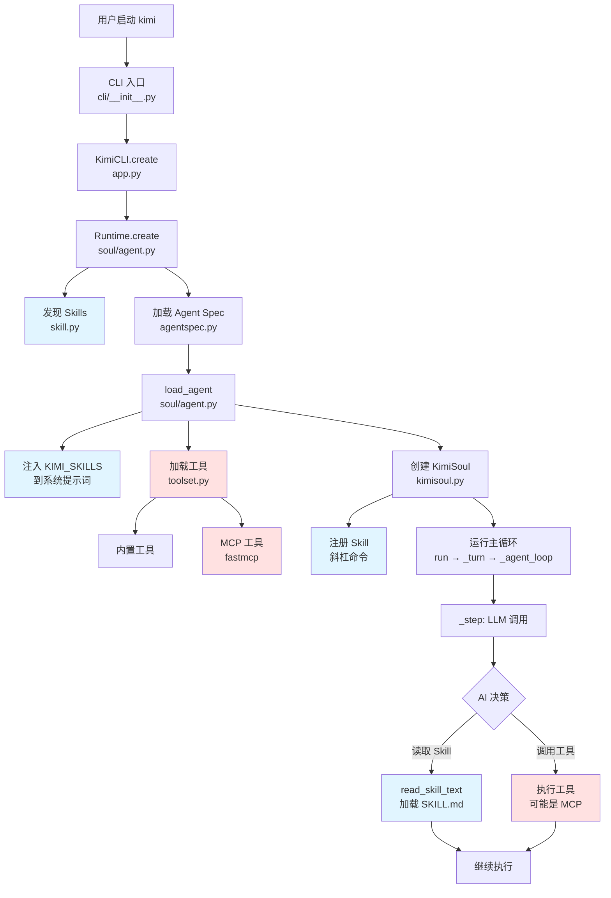

# 01 - Skill 与 MCP 协同机制：整体架构与执行流程梳理

## 学习目标

通过本文档，你将了解：
1. Skill 和 MCP 在 Kimi CLI 中的整体架构位置
2. 从启动到执行的完整代码堆栈流程
3. 两者协同工作的关键节点
4. 后续深入学习的路线图

---

## 一、整体架构图



**图例**：
- 🔵 蓝色框：Skill 相关流程
- 🔴 红色框：MCP 相关流程

---

## 二、代码执行堆栈概览

### 阶段 1️⃣: 启动与初始化

```
📁 cli/__init__.py
  └─ kimi() 函数
     └─ asyncio.run(_run())
        └─ 调用 KimiCLI.create()

📁 app.py
  └─ KimiCLI.create()
     ├─ Session.create() / Session.continue_()
     └─ Runtime.create()  ← 关键！Skill 和 MCP 在这里开始分叉

📁 soul/agent.py
  └─ Runtime.create()
     ├─ 🔵 discover_skills_from_roots()  # Skill 发现
     ├─ 🔵 格式化 KIMI_SKILLS 参数
     └─ 返回 Runtime 实例（包含 skills 字典）
```

**关键点**：
- `Runtime.create()` 是 Skill 和 MCP 的**起点**
- Skill 在这个阶段被**发现**和**索引**
- MCP 工具尚未加载（稍后在 `load_agent()` 中加载）

---

### 阶段 2️⃣: Agent 加载

```
📁 soul/agent.py
  └─ load_agent()
     ├─ load_agent_spec()  # 加载 YAML 配置
     ├─ _load_system_prompt()
     │  └─ 🔵 string.Template(system_prompt).substitute(
     │        KIMI_SKILLS=skills_formatted  # Skill 注入系统提示词
     │     )
     ├─ KimiToolset()
     │  └─ toolset.load_tools()  # 加载内置工具
     └─ 🔴 toolset.load_mcp_tools()  # 加载 MCP 工具
```

**关键点**：
- 🔵 Skill 通过**模板替换**注入系统提示词
- 🔴 MCP 工具通过 `fastmcp` 加载
- 两者都在 `load_agent()` 完成后可用

---

### 阶段 3️⃣: Soul 初始化

```
📁 app.py
  └─ KimiCLI.create() 继续
     └─ KimiSoul(agent, context=context)

📁 soul/kimisoul.py
  └─ KimiSoul.__init__()
     └─ 🔵 self._register_skill_commands()
        └─ 为每个 Skill 注册 /skill:xxx 斜杠命令
```

**关键点**：
- 🔵 Skill 斜杠命令在这里注册
- 用户可以通过 `/skill:name` 手动触发 Skill

---

### 阶段 4️⃣: 主循环执行

```
📁 soul/kimisoul.py
  └─ KimiSoul.run(user_input)
     ├─ 检查是否为斜杠命令
     │  └─ 如果是 /skill:xxx → 🔵 _make_skill_command()
     │     └─ read_skill_text() → 读取 SKILL.md
     │     └─ _turn(Message(content=skill_text))
     │
     └─ _turn(user_message)
        └─ _agent_loop()
           └─ _step()
              ├─ kosong.step()  # LLM 调用
              │  └─ AI 查看系统提示词中的 KIMI_SKILLS
              │     └─ AI 决定是否需要读取某个 Skill
              │
              └─ result.tool_results()
                 └─ 🔴 执行工具（可能包括 MCP 工具）
```

**关键点**：
- AI 在每次 LLM 调用时都能看到 `KIMI_SKILLS` 列表
- AI 可以**自主决定**读取哪个 Skill（通过文件工具）
- AI 可以调用 MCP 工具执行实际操作

---

## 三、Skill 与 MCP 的协同时刻

### 协同场景 1: AI 自主协同

```
用户输入: "帮我分析这个 BigQuery 数据库的用户增长"

执行流程:
1. _step() 调用 LLM
2. LLM 查看系统提示词，发现:
   ${KIMI_SKILLS}
   - bigquery-analysis
     - Path: ~/.kimi/skills/bigquery-analysis/SKILL.md
     - Description: BigQuery 数据分析工作流

3. LLM 决定读取 Skill:
   🔵 调用 File 工具读取 SKILL.md

4. SKILL.md 内容告诉 LLM:
   "使用 BigQuery MCP 工具查询数据"

5. LLM 调用 MCP 工具:
   🔴 调用 bigquery_query(sql="SELECT ...")

6. 获取结果后，按 Skill 中的分析框架处理数据
```

### 协同场景 2: 用户显式协同

```
用户输入: "/skill:bigquery-analysis 分析用户增长"

执行流程:
1. run() 检测到斜杠命令
2. 🔵 _make_skill_command() 被调用
3. 🔵 read_skill_text() 读取 SKILL.md
4. 将 SKILL.md + "分析用户增长" 作为用户消息
5. _turn() 执行，LLM 按 Skill 指导调用 MCP 工具
```

---

## 四、核心文件清单

按照执行顺序，以下是关键文件：

| 顺序 | 文件 | 作用 | Skill | MCP |
|-----|------|------|-------|-----|
| 1 | `cli/__init__.py` | CLI 入口 | - | - |
| 2 | `app.py` | 应用层 | - | - |
| 3 | `soul/agent.py` | Runtime/Agent 管理 | ✅ | ✅ |
| 4 | `skill.py` | Skill 发现与加载 | ✅ | - |
| 5 | `agentspec.py` | Agent Spec 解析 | - | - |
| 6 | `soul/toolset.py` | 工具集管理 | - | ✅ |
| 7 | `soul/kimisoul.py` | 主循环 | ✅ | ✅ |
| 8 | `agents/default/system.md` | 系统提示词模板 | ✅ | - |

---

## 五、后续深入学习路线

### 第 1 层：基础层（已完成 ✅）
- [x] 整体架构梳理
- [x] 执行流程概览

### 第 2 层：Skill 深入
- [ ] **02**: `Runtime.create()` - Skill 发现机制详解
- [ ] **03**: `skill.py` - discover_skills() 源码分析
- [ ] **04**: `_load_system_prompt()` - Skill 注入机制
- [ ] **05**: `_register_skill_commands()` - 斜杠命令注册
- [ ] **06**: `_make_skill_command()` - Skill 触发执行

### 第 3 层：MCP 深入
- [ ] **07**: `toolset.py` - MCP 工具加载机制
- [ ] **08**: `load_mcp_tools()` - fastmcp 集成
- [ ] **09**: 工具执行流程 - kosong.step()

### 第 4 层：协同深入
- [ ] **10**: AI 决策机制 - 如何选择 Skill
- [ ] **11**: 工具调用链 - Skill → MCP 的完整路径
- [ ] **12**: 实战案例分析 - 真实场景追踪

---

## 六、本文档涉及的关键代码片段

### 代码片段 1: Runtime.create() - 启动点

```python
# src/kimi_cli/soul/agent.py:82-131

@staticmethod
async def create(
    config: Config,
    llm: LLM | None,
    session: Session,
    yolo: bool,
    skills_dir: Path | None = None,
) -> Runtime:
    # ... 省略前面代码 ...
    
    # 🔵 Skill 发现
    builtin_skills_dir = get_builtin_skills_dir()
    if skills_dir is None:
        skills_dir = get_skills_dir()
        if not skills_dir.is_dir() and (claude_skills_dir := get_claude_skills_dir()).is_dir():
            skills_dir = claude_skills_dir
    skills_roots = [builtin_skills_dir, skills_dir]
    skills = discover_skills_from_roots(skills_roots)  # ← 关键调用
    skills_by_name = index_skills(skills)
    
    # 🔵 格式化 Skill 信息
    skills_formatted = "\n".join(
        (
            f"- {skill.name}\n"
            f"  - Path: {skill.skill_md_file}\n"
            f"  - Description: {skill.description}"
        )
        for skill in skills
    )
    
    return Runtime(
        # ... 其他参数 ...
        builtin_args=BuiltinSystemPromptArgs(
            # ... 其他参数 ...
            KIMI_SKILLS=skills_formatted or "No skills found.",  # ← 注入
        ),
        skills=skills_by_name,  # ← 保存到 Runtime
    )
```

**关键点**：
- `discover_skills_from_roots()` 扫描多个目录
- 格式化为 `name + path + description` 的列表
- 通过 `KIMI_SKILLS` 参数传递给系统提示词

---

### 代码片段 2: load_agent() - MCP 加载点

```python
# src/kimi_cli/soul/agent.py:194-269

async def load_agent(
    agent_file: Path,
    runtime: Runtime,
    *,
    mcp_configs: list[MCPConfig] | list[dict[str, Any]],
) -> Agent:
    # ... 省略前面代码 ...
    
    # 加载内置工具
    toolset = KimiToolset()
    toolset.load_tools(tools, tool_deps)
    
    # 🔴 加载 MCP 工具
    if mcp_configs:
        validated_mcp_configs: list[MCPConfig] = []
        # ... 验证配置 ...
        await toolset.load_mcp_tools(validated_mcp_configs, runtime)  # ← 关键调用
    
    return Agent(
        name=agent_spec.name,
        system_prompt=system_prompt,  # ← 包含 KIMI_SKILLS
        toolset=toolset,  # ← 包含 MCP 工具
        runtime=runtime,  # ← 包含 skills 字典
    )
```

**关键点**：
- `load_mcp_tools()` 异步加载 MCP 服务器
- `Agent` 同时持有系统提示词（含 Skill）和工具集（含 MCP）

---

## 七、思考题

在进入下一步深入学习之前，请思考：

1. **为什么 Skill 在 `Runtime.create()` 中发现，而不是更晚？**
   - 提示：考虑系统提示词的生成时机

2. **为什么 MCP 工具在 `load_agent()` 中加载，而不是更早？**
   - 提示：考虑 Agent Spec 和工具依赖注入

3. **Skill 可以不通过斜杠命令被使用吗？**
   - 提示：AI 如何读取 SKILL.md？

---

## 八、下一步学习

根据你的反馈，我们将深入以下内容之一：

**选项 A**: Skill 深入 → 从 `Runtime.create()` 开始逐行分析  
**选项 B**: MCP 深入 → 从 `load_mcp_tools()` 开始逐行分析  
**选项 C**: 先看一个完整的协同案例追踪

**请告诉我你想先学习哪个方向，我将准备下一份文档。**

---

**文档状态**: ✅ 已完成  
**下一步**: 等待反馈
