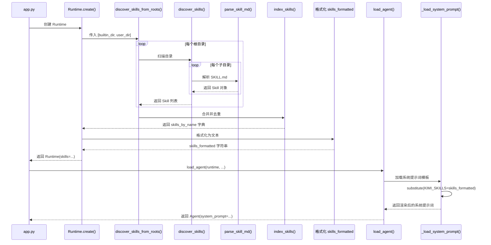

# 02 - Skill 加载机制深度解析

## 学习目标

通过本文档，你将掌握：
1. Skill 从发现到注入系统提示词的完整流程
2. 每个函数的详细代码分析
3. 实际运行时的数据流转
4. 调试和追踪 Skill 加载的方法

---

## 一、Skill 加载完整流程图



---

## 二、核心代码逐行解析

### 2.1 入口：Runtime.create()

**文件**: `src/kimi_cli/soul/agent.py`  
**行号**: L82-L131

```python
@staticmethod
async def create(
    config: Config,
    llm: LLM | None,
    session: Session,
    yolo: bool,
    skills_dir: Path | None = None,  # ← 可选的自定义 Skills 目录
) -> Runtime:
    # ... 省略前面代码 ...
    
    # ========== 第 1 步: 确定 Skills 搜索路径 ==========
    builtin_skills_dir = get_builtin_skills_dir()  # ← 内置 Skills
    if skills_dir is None:
        skills_dir = get_skills_dir()  # ← 默认用户目录 ~/.kimi/skills
        # 兼容 Claude Skills
        if not skills_dir.is_dir() and (claude_skills_dir := get_claude_skills_dir()).is_dir():
            skills_dir = claude_skills_dir
    
    skills_roots = [builtin_skills_dir, skills_dir]  # ← 搜索路径列表
```

**关键点**：
- `skills_roots` 是一个列表，包含多个搜索根目录
- 顺序很重要：`[内置, 用户]`，后面的会覆盖前面的同名 Skill

---

**继续**：

```python
    # ========== 第 2 步: 发现所有 Skills ==========
    skills = discover_skills_from_roots(skills_roots)  # ← 核心函数
    skills_by_name = index_skills(skills)  # ← 建立名称索引
    
    logger.info("Discovered {count} skill(s)", count=len(skills))
```

**关键点**：
- `discover_skills_from_roots()` 返回 `list[Skill]`
- `index_skills()` 转换为 `dict[str, Skill]`，方便按名称查找

---

**继续**：

```python
    # ========== 第 3 步: 格式化 Skills 信息 ==========
    skills_formatted = "\n".join(
        (
            f"- {skill.name}\n"
            f"  - Path: {skill.skill_md_file}\n"
            f"  - Description: {skill.description}"
        )
        for skill in skills
    )
```

**输出示例**：
```
- kimi-cli-help
  - Path: /path/to/kimi_cli/skills/kimi-cli-help/SKILL.md
  - Description: Answer Kimi CLI usage, configuration, and troubleshooting questions.
- skill-creator
  - Path: /path/to/kimi_cli/skills/skill-creator/SKILL.md
  - Description: Guide for creating effective skills.
```

**关键点**：
- 这是 AI 看到的 Skills 列表
- 包含 3 个关键信息：名称、路径、描述

---

**继续**：

```python
    # ========== 第 4 步: 创建 Runtime 实例 ==========
    return Runtime(
        config=config,
        llm=llm,
        session=session,
        builtin_args=BuiltinSystemPromptArgs(
            KIMI_NOW=datetime.now().astimezone().isoformat(),
            KIMI_WORK_DIR=session.work_dir,
            KIMI_WORK_DIR_LS=ls_output,
            KIMI_AGENTS_MD=agents_md or "",
            KIMI_SKILLS=skills_formatted or "No skills found.",  # ← 注入
        ),
        denwa_renji=DenwaRenji(),
        approval=Approval(yolo=yolo),
        labor_market=LaborMarket(),
        environment=environment,
        skills=skills_by_name,  # ← 保存 Skills 字典
    )
```

**关键点**：
- `KIMI_SKILLS` 保存格式化后的 Skills 列表（字符串）
- `skills` 保存 Skills 字典（Python 对象），供后续使用

---

### 2.2 核心函数：discover_skills_from_roots()

**文件**: `src/kimi_cli/skill.py`  
**行号**: L46-L54

```python
def discover_skills_from_roots(skills_dirs: Iterable[Path]) -> list[Skill]:
    """
    从多个目录根发现 Skills。
    
    Args:
        skills_dirs: Skills 根目录列表，例如 [内置目录, 用户目录]
    
    Returns:
        Skill 对象列表，已去重并排序
    """
    skills_by_name: dict[str, Skill] = {}  # ← 用于去重
    
    # 遍历每个根目录
    for skills_dir in skills_dirs:
        for skill in discover_skills(skills_dir):  # ← 发现单个目录的 Skills
            # 后发现的覆盖先发现的（用户 Skills 优先）
            skills_by_name[normalize_skill_name(skill.name)] = skill
    
    # 按名称排序后返回
    return sorted(skills_by_name.values(), key=lambda s: s.name)
```

**执行示例**：

```python
# 假设目录结构：
# /path/to/kimi_cli/skills/
# ├── kimi-cli-help/
# │   └── SKILL.md
# └── skill-creator/
#     └── SKILL.md
#
# ~/.kimi/skills/
# └── my-custom-skill/
#     └── SKILL.md

skills_dirs = [
    Path("/path/to/kimi_cli/skills"),
    Path("~/.kimi/skills").expanduser()
]

# 第 1 次循环: skills_dir = /path/to/kimi_cli/skills
# discover_skills() 返回:
#   [Skill(name="kimi-cli-help", ...), Skill(name="skill-creator", ...)]
# skills_by_name = {
#   "kimi-cli-help": Skill(...),
#   "skill-creator": Skill(...)
# }

# 第 2 次循环: skills_dir = ~/.kimi/skills
# discover_skills() 返回:
#   [Skill(name="my-custom-skill", ...)]
# skills_by_name = {
#   "kimi-cli-help": Skill(...),
#   "skill-creator": Skill(...),
#   "my-custom-skill": Skill(...)
# }

# 最终返回: [kimi-cli-help, my-custom-skill, skill-creator]（按字母排序）
```

**关键点**：
- `skills_by_name` 字典实现去重逻辑
- 同名 Skill 以最后发现的为准

---

### 2.3 单目录发现：discover_skills()

**文件**: `src/kimi_cli/skill.py`  
**行号**: L85-L117

```python
def discover_skills(skills_dir: Path) -> list[Skill]:
    """
    发现给定目录中的所有 Skills。
    
    Args:
        skills_dir: 包含 Skills 的目录路径
    
    Returns:
        Skill 对象列表
    """
    # 检查目录是否存在
    if not skills_dir.is_dir():
        return []
    
    skills: list[Skill] = []
    
    # 遍历所有子目录
    for skill_dir in skills_dir.iterdir():
        # 跳过非目录
        if not skill_dir.is_dir():
            continue
        
        # 检查 SKILL.md 是否存在
        skill_md = skill_dir / "SKILL.md"
        if not skill_md.is_file():
            continue
        
        # 尝试解析 SKILL.md
        try:
            skills.append(parse_skill_md(skill_md))  # ← 解析单个 Skill
        except Exception as e:
            # 跳过无效的 Skills，但记录日志
            logger.info("Skipping invalid skill at {}: {}", skill_md, e)
            continue
    
    # 按名称排序
    return sorted(skills, key=lambda s: s.name)
```

**执行示例**：

```python
# 输入: skills_dir = Path("~/.kimi/skills")
# 目录结构:
# ~/.kimi/skills/
# ├── code-style/
# │   └── SKILL.md  ← 有效
# ├── my-notes.txt  ← 跳过（不是目录）
# ├── draft-skill/  ← 跳过（没有 SKILL.md）
# └── invalid-skill/
#     └── SKILL.md  ← 解析失败，跳过

# 第 1 次迭代: skill_dir = code-style/
#   skill_md = code-style/SKILL.md (存在)
#   parse_skill_md() 成功 → 添加到 skills

# 第 2 次迭代: skill_dir = my-notes.txt
#   不是目录 → 跳过

# 第 3 次迭代: skill_dir = draft-skill/
#   skill_md = draft-skill/SKILL.md (不存在) → 跳过

# 第 4 次迭代: skill_dir = invalid-skill/
#   skill_md = invalid-skill/SKILL.md (存在)
#   parse_skill_md() 抛出异常 → 记录日志，跳过

# 返回: [Skill(name="code-style", ...)]
```

**关键点**：
- 只接受包含 `SKILL.md` 的子目录
- 解析失败不会中断，只会跳过

---

### 2.4 解析 SKILL.md：parse_skill_md()

**文件**: `src/kimi_cli/skill.py`  
**行号**: L120-L145

```python
def parse_skill_md(skill_md_file: Path) -> Skill:
    """
    解析 SKILL.md 文件，提取名称和描述。
    
    Args:
        skill_md_file: SKILL.md 文件路径
    
    Returns:
        Skill 对象
    
    Raises:
        ValueError: 如果 SKILL.md 无效
    """
    # 读取 YAML frontmatter
    frontmatter = read_frontmatter(skill_md_file) or {}
    
    # 如果没有 name 字段，使用目录名
    if "name" not in frontmatter:
        frontmatter["name"] = skill_md_file.parent.name
    
    # 如果没有 description 字段，使用默认值
    if "description" not in frontmatter:
        frontmatter["description"] = "No description provided."
    
    # 验证并创建 Skill 对象
    return Skill.model_validate(
        {
            **frontmatter,
            "dir": skill_md_file.parent.absolute(),  # ← 添加目录路径
        }
    )
```

**SKILL.md 示例**：

```markdown
---
name: code-style
description: 项目代码风格指南
---

## 代码规范

...
```

**执行示例**：

```python
# 输入: skill_md_file = Path("~/.kimi/skills/code-style/SKILL.md")

# read_frontmatter() 返回:
# {
#     "name": "code-style",
#     "description": "项目代码风格指南"
# }

# 最终创建:
# Skill(
#     name="code-style",
#     description="项目代码风格指南",
#     dir=Path("/home/user/.kimi/skills/code-style")
# )
```

**Skill 类定义**：

```python
class Skill(BaseModel):
    """单个 Skill 的信息"""
    
    name: str                    # Skill 名称
    description: str             # Skill 描述
    dir: Path                    # Skill 目录路径
    
    @property
    def skill_md_file(self) -> Path:
        """SKILL.md 文件路径"""
        return self.dir / "SKILL.md"
```

---

## 三、数据流转示例

### 示例场景：启动 Kimi CLI 时加载 Skills

**假设环境**：
- 内置 Skills: `kimi-cli-help`, `skill-creator`
- 用户 Skills: `my-project-style`

**执行流程**：

```python
# ========== Step 1: Runtime.create() 开始 ==========
skills_roots = [
    Path("/usr/local/lib/python3.12/site-packages/kimi_cli/skills"),  # 内置
    Path("/home/user/.kimi/skills")                                    # 用户
]

# ========== Step 2: discover_skills_from_roots() ==========
skills_by_name = {}

# 第 1 个根目录
for skill in discover_skills(skills_roots[0]):
    # skill = Skill(name="kimi-cli-help", ...)
    skills_by_name["kimi-cli-help"] = skill
    # skill = Skill(name="skill-creator", ...)
    skills_by_name["skill-creator"] = skill

# 第 2 个根目录
for skill in discover_skills(skills_roots[1]):
    # skill = Skill(name="my-project-style", ...)
    skills_by_name["my-project-style"] = skill

# 结果:
# skills_by_name = {
#     "kimi-cli-help": Skill(...),
#     "skill-creator": Skill(...),
#     "my-project-style": Skill(...)
# }

# ========== Step 3: 格式化 ==========
skills_formatted = """
- kimi-cli-help
  - Path: /usr/local/lib/.../kimi_cli/skills/kimi-cli-help/SKILL.md
  - Description: Answer Kimi CLI usage questions.
- my-project-style
  - Path: /home/user/.kimi/skills/my-project-style/SKILL.md
  - Description: 项目代码风格指南
- skill-creator
  - Path: /usr/local/lib/.../kimi_cli/skills/skill-creator/SKILL.md
  - Description: Guide for creating skills.
"""

# ========== Step 4: 注入到 Runtime ==========
runtime = Runtime(
    builtin_args=BuiltinSystemPromptArgs(
        KIMI_SKILLS=skills_formatted,
        # ...
    ),
    skills=skills_by_name,
    # ...
)
```

---

## 四、Skills 如何注入系统提示词

### 4.1 系统提示词模板

**文件**: `src/kimi_cli/agents/default/system.md`  
**相关行**: L98-L120

```markdown
# Skills

Skills are reusable, composable capabilities that enhance your abilities.

## Available skills

${KIMI_SKILLS}  ← 这里被替换

## How to use skills

Identify the skills that are likely to be useful for the tasks you are currently working on,
read the `SKILL.md` file for detailed instructions.

Only read skill details when needed to conserve the context window.
```

### 4.2 模板替换

**文件**: `src/kimi_cli/soul/agent.py`  
**函数**: `_load_system_prompt()`  
**行号**: L272-L282

```python
def _load_system_prompt(
    path: Path,
    args: dict[str, str],
    builtin_args: BuiltinSystemPromptArgs
) -> str:
    logger.info("Loading system prompt: {path}", path=path)
    
    # 读取模板文件
    system_prompt = path.read_text(encoding="utf-8").strip()
    
    logger.debug(
        "Substituting system prompt with builtin args: {builtin_args}, spec args: {spec_args}",
        builtin_args=builtin_args,
        spec_args=args,
    )
    
    # 使用 string.Template 进行替换
    return string.Template(system_prompt).substitute(
        asdict(builtin_args),  # ← 包含 KIMI_SKILLS
        **args
    )
```

**执行示例**：

```python
# builtin_args = BuiltinSystemPromptArgs(
#     KIMI_NOW="2026-01-14T16:51:18+08:00",
#     KIMI_WORK_DIR="/opt/script/kimi-cli",
#     KIMI_WORK_DIR_LS="...",
#     KIMI_AGENTS_MD="...",
#     KIMI_SKILLS="- kimi-cli-help\n  - Path: ...\n  - Description: ..."
# )

# 模板中的 ${KIMI_SKILLS} 被替换为实际的 Skills 列表

# 最终系统提示词包含:
"""
## Available skills

- kimi-cli-help
  - Path: /usr/local/lib/.../kimi-cli-help/SKILL.md
  - Description: Answer Kimi CLI usage questions.
- skill-creator
  - Path: /usr/local/lib/.../skill-creator/SKILL.md
  - Description: Guide for creating skills.
"""
```

---

## 五、实际运行追踪

### 5.1 添加日志追踪

你可以在关键位置添加日志来观察 Skills 加载：

```python
# 在 Runtime.create() 中
logger.info("Discovered {count} skill(s)", count=len(skills))

# 在 discover_skills() 中
logger.info("Scanning skills directory: {}", skills_dir)

# 在 parse_skill_md() 中
logger.debug("Parsing skill: {}", skill_md_file)
```

### 5.2 运行并查看日志

```bash
# 启动调试模式
uv run kimi --debug

# 日志输出示例:
# INFO     Scanning skills directory: /usr/local/lib/.../kimi_cli/skills
# DEBUG    Parsing skill: /usr/local/lib/.../kimi_cli/skills/kimi-cli-help/SKILL.md
# DEBUG    Parsing skill: /usr/local/lib/.../kimi_cli/skills/skill-creator/SKILL.md
# INFO     Scanning skills directory: /home/user/.kimi/skills
# DEBUG    Parsing skill: /home/user/.kimi/skills/my-project-style/SKILL.md
# INFO     Discovered 3 skill(s)
```

### 5.3 使用 Python 调试器

```python
# 在 Runtime.create() 中设置断点
import pdb; pdb.set_trace()

# 然后检查变量:
(Pdb) skills_roots
[PosixPath('/usr/local/lib/.../kimi_cli/skills'), PosixPath('/home/user/.kimi/skills')]

(Pdb) skills
[Skill(name='kimi-cli-help', ...), Skill(name='my-project-style', ...), Skill(name='skill-creator', ...)]

(Pdb) skills_formatted
'- kimi-cli-help\n  - Path: ...\n  - Description: ...'
```

---

## 六、关键要点总结

### ✅ Skill 加载的 5 个阶段

1. **确定搜索路径** → `[内置目录, 用户目录]`
2. **扫描目录** → `discover_skills_from_roots()`
3. **解析 SKILL.md** → `parse_skill_md()`
4. **格式化** → `skills_formatted` 字符串
5. **注入系统提示词** → `_load_system_prompt()`

### ✅ 关键数据结构

| 阶段 | 数据类型 | 示例 |
|------|---------|------|
| 发现后 | `list[Skill]` | `[Skill(...), Skill(...)]` |
| 索引后 | `dict[str, Skill]` | `{"name": Skill(...)}` |
| 格式化后 | `str` | `"- name\n  - Path: ...\n  - Description: ..."` |
| 注入后 | `str` (系统提示词) | 包含 Skills 列表的完整提示词 |

### ✅ 设计亮点

1. **多目录支持** - 内置 + 用户 + Claude 兼容
2. **优先级覆盖** - 用户 Skills 优先于内置
3. **容错处理** - 解析失败不影响其他 Skills
4. **渐进式披露** - 元数据始终在上下文，内容按需加载

---

## 七、下一步学习

现在你已经完全理解了 **Skill 的加载机制**，下一步我们将学习：

**选项 A**: **Skill 的使用机制** - AI 如何读取和使用 Skills（斜杠命令、自主触发）

**选项 B**: **MCP 加载机制** - MCP 工具如何被加载和初始化

**选项 C**: **实战演练** - 创建一个自定义 Skill 并调试加载过程

**请告诉我你想学习哪个方向，我将准备下一份文档。**

---

**文档状态**: ✅ 已完成  
**下一步**: 等待反馈
