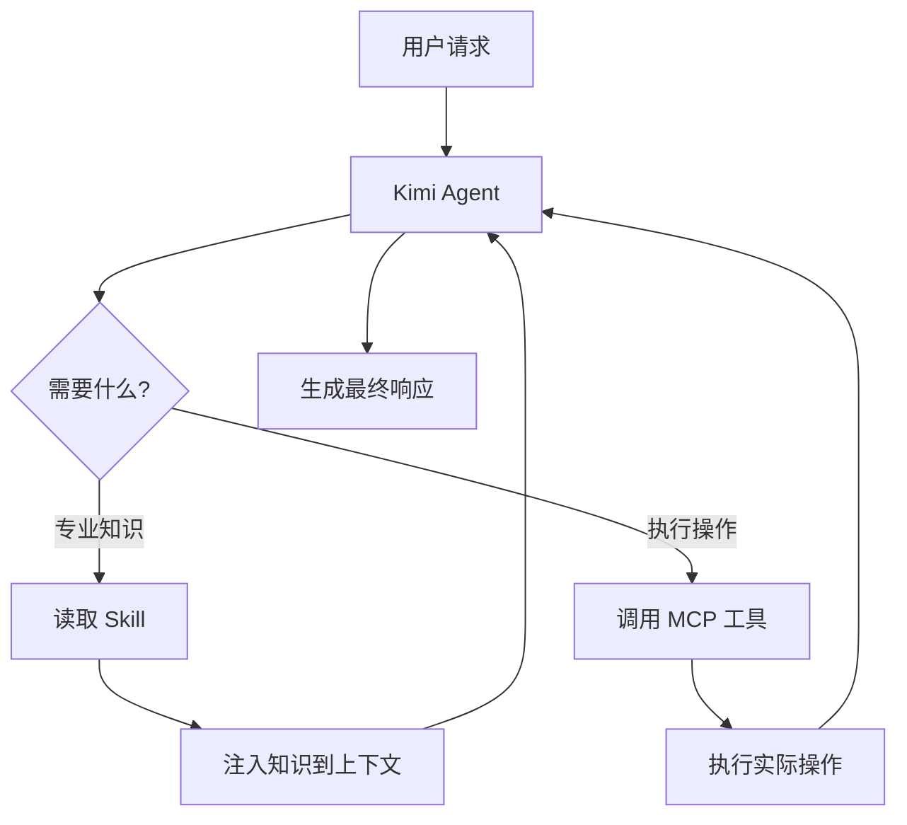
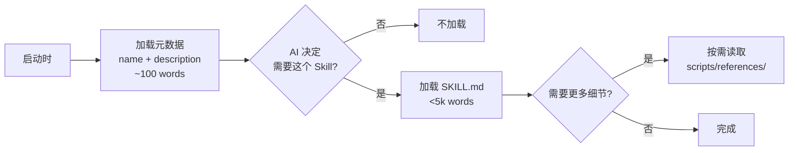

# Kimi CLI 中的 Skill 技术栈深度解析

## 核心回答

**是的，kimi-cli 使用了 Skill 技术栈！**

Skill 和 MCP 是两种**互补而非竞争**的技术，它们在 Kimi CLI 中各司其职：

| 对比维度 | Skill | MCP (Model Context Protocol) |
|---------|-------|------------------------------|
| **本质** | 静态知识和提示词模板 | 动态工具和资源提供 |
| **作用** | 注入专业知识、工作流、最佳实践 | 提供可执行工具和实时数据 |
| **格式** | SKILL.md 文件（Markdown + YAML） | 服务器/客户端协议 |
| **触发方式** | AI 自主决定读取 / 斜杠命令 | 工具调用 |
| **内容类型** | 提示词、文档、参考资料、脚本 | 函数、API、数据库查询 |
| **典型用例** | 代码规范、Git 提交规范、领域知识 | 搜索、文件操作、API 调用 |

---

## 1. Skill 是什么？

### 1.1 定义

**Skill（代理技能）** 是一种开放格式，用于为 AI 代理添加专业知识和工作流。每个 Skill 是一个包含 `SKILL.md` 文件的目录，提供：

- **专业知识**: 领域特定的专业技能（PDF 处理、数据分析等）
- **工作流模式**: 常见任务的最佳实践
- **工具集成**: 特定操作的预配置工具链
- **参考资料**: 文档、模板和示例

### 1.2 Skill 结构

```
my-skill/
├── SKILL.md          # 必需：主文件（YAML frontmatter + Markdown）
├── scripts/          # 可选：可执行脚本（Python/Bash 等）
├── references/       # 可选：参考文档（按需加载）
└── assets/           # 可选：资源文件（模板、图标等）
```

**SKILL.md 格式**:
```markdown
---
name: code-style
description: 项目代码规范指南。当需要了解代码风格、命名规范时使用
---

## 代码规范

在本项目中，请遵循以下约定：
- 使用 4 空格缩进
- 变量名使用 camelCase
- 函数名使用 snake_case
...
```

---

## 2. Skill 与 MCP 的关系

### 2.1 它们如何协作



### 2.2 实际场景示例

**场景：创建符合规范的 Git 提交**

1. **Skill 提供知识**:
   - 用户有一个 `git-commits` Skill，定义了 Conventional Commits 规范
   - Agent 读取 SKILL.md，了解提交格式：`type(scope): description`

2. **MCP 提供工具**:
   - Agent 使用 Shell 工具（可能通过 MCP）执行 `git commit -m "feat(auth): add OAuth login"`

**结果**: Skill 告诉 AI "怎么做才对"，MCP 让 AI "真正去做"。

### 2.3 关键区别

| 维度 | Skill | MCP |
|-----|-------|-----|
| **静态 vs 动态** | 静态文档 | 动态工具 |
| **注入时机** | 启动时（元数据）+ 按需（内容） | 运行时（工具调用） |
| **上下文占用** | 渐进式（name → description → 完整内容） | 仅工具定义 |
| **执行能力** | 无（仅提供指导） | 有（可执行代码） |
| **配置位置** | `~/.kimi/skills/` | `~/.kimi/mcp-config.toml` |

---

## 3. Skill 的技术实现细节

### 3.1 发现机制 (Discovery)

**源码位置**: `src/kimi_cli/skill.py`

```python
def discover_skills_from_roots(skills_dirs: Iterable[Path]) -> list[Skill]:
    """从多个根目录发现 Skills"""
    skills_by_name: dict[str, Skill] = {}
    for skills_dir in skills_dirs:
        for skill in discover_skills(skills_dir):
            # 后发现的 Skill 覆盖先发现的同名 Skill
            skills_by_name[normalize_skill_name(skill.name)] = skill
    return sorted(skills_by_name.values(), key=lambda s: s.name)
```

**发现优先级** (从低到高):
1. 内置 Skills: `src/kimi_cli/skills/`
2. 用户 Skills: `~/.kimi/skills/`
3. Claude 兼容: `~/.claude/skills/`
4. 自定义目录: `--skills-dir /path/to/skills`

### 3.2 加载流程

**源码位置**: `src/kimi_cli/soul/agent.py`

```python
# Runtime.create() 中
skills_roots = [builtin_skills_dir, skills_dir]
skills = discover_skills_from_roots(skills_roots)
skills_by_name = index_skills(skills)

# 格式化为系统提示词参数
skills_formatted = "\n".join(
    (
        f"- {skill.name}\n"
        f"  - Path: {skill.skill_md_file}\n"
        f"  - Description: {skill.description}"
    )
    for skill in skills
)

# 注入到系统提示词
builtin_args = BuiltinSystemPromptArgs(
    KIMI_NOW=...,
    KIMI_WORK_DIR=...,
    KIMI_SKILLS=skills_formatted or "No skills found.",
)
```

### 3.3 注入系统提示词

**源码位置**: `src/kimi_cli/agents/default/system.md`

系统提示词中包含 Skill 相关说明（第 98-120 行）:

```markdown
# Skills

Skills are reusable, composable capabilities that enhance your abilities.

## Available skills

${KIMI_SKILLS}  # 这里注入所有 Skill 的元数据

## How to use skills

Identify the skills that are likely to be useful for the tasks you are currently working on,
read the `SKILL.md` file for detailed instructions.

Only read skill details when needed to conserve the context window.
```

### 3.4 斜杠命令注册

**源码位置**: `src/kimi_cli/soul/kimisoul.py`

```python
SKILL_COMMAND_PREFIX = "skill:"

def _register_skill_commands(self) -> None:
    """为每个 Skill 注册斜杠命令"""
    for skill in self._runtime.skills.values():
        name = f"{SKILL_COMMAND_PREFIX}{skill.name}"
        soul_slash_registry.command(name=name)(
            self._make_skill_command(skill)
        )

def _make_skill_command(self, skill: Skill):
    """创建 Skill 命令处理函数"""
    async def _run_skill(soul: KimiSoul, args: str, *, _skill: Skill = skill):
        # 读取 SKILL.md 内容
        skill_text = read_skill_text(_skill)
        if skill_text is None:
            wire_send(TextPart(text=f'Failed to load skill...'))
            return
        
        # 如果用户提供了额外参数，追加到 skill 内容后
        extra = args.strip()
        if extra:
            skill_text = f"{skill_text}\n\nUser request:\n{extra}"
        
        # 将 skill 内容作为用户消息发送，触发一轮对话
        await soul._turn(Message(role="user", content=skill_text))
    
    _run_skill.__doc__ = skill.description
    return _run_skill
```

### 3.5 渐进式加载 (Progressive Disclosure)

Skill 采用三级加载策略，优化上下文窗口使用:



**关键原则**:
- **元数据始终在上下文中**: 让 AI 知道有哪些 Skills 可用
- **内容按需加载**: AI 自主决定何时读取完整 SKILL.md
- **资源懒加载**: 仅在需要时读取 scripts/references

---

## 4. Skill 的触发方式

### 4.1 自动触发（AI 决定）

AI 根据任务需求自主决定是否读取 Skill:

```
用户: "帮我创建一个符合规范的 PPT"

AI 思考:
1. 查看系统提示词中的 ${KIMI_SKILLS} 列表
2. 发现 "pptx" skill (description: Create and edit PowerPoint presentations)
3. 决定读取 ~/.kimi/skills/pptx/SKILL.md
4. 按照 Skill 中的工作流创建 PPT
```

### 4.2 手动触发（斜杠命令）

用户显式调用 Skill:

```bash
# 基本用法
/skill:code-style

# 带额外参数
/skill:git-commits 修复了用户登录问题

# 等价于将 SKILL.md 内容 + "修复了用户登录问题" 作为用户消息发送
```

---

## 5. 内置 Skills 分析

### 5.1 kimi-cli-help

**用途**: 回答 Kimi CLI 相关问题

**SKILL.md 节选**:
```markdown
---
name: kimi-cli-help
description: Answer Kimi CLI usage, configuration, and troubleshooting questions.
             Use when user asks about installation, setup, MCP integration, etc.
---

# Kimi CLI Help

## Strategy
1. Prefer official documentation for most questions
2. Read local source when in kimi-cli project itself
3. Clone and explore source for complex internals

## Documentation
Base URL: https://moonshotai.github.io/kimi-cli/

Fetch documentation index:
https://moonshotai.github.io/kimi-cli/llms.txt
```

**设计亮点**:
- 提供文档索引 URL，让 AI 可以通过 Web 工具获取最新文档
- 定义查找策略，优先使用官方文档

### 5.2 skill-creator

**用途**: 指导 AI 创建新的 Skills

**SKILL.md 关键内容**:
- Skill 的核心原则（简洁、渐进式披露）
- Skill 目录结构
- 创建流程（6 个步骤）
- 设计模式和最佳实践

**350+ 行的完整指南**，确保 AI 能创建高质量的 Skills！

---

## 6. Skill 与 MCP 的组合使用场景

### 场景 1: 技术文档生成

**Skill 提供**: 文档模板、写作规范  
**MCP 提供**: 文件读写工具、代码分析工具

```
用户: "为这个项目生成 API 文档"

1. AI 读取 "api-docs" Skill（模板和规范）
2. 使用文件工具（MCP）扫描代码
3. 按照 Skill 中的模板生成文档
4. 使用文件工具（MCP）写入文档
```

### 场景 2: 代码审查

**Skill 提供**: 代码质量检查清单、安全规范  
**MCP 提供**: Git 操作、代码分析工具

```
用户: "审查这个 PR"

1. AI 读取 "code-review" Skill（审查标准）
2. 使用 Git 工具（MCP）获取改动
3. 按照 Skill 中的检查清单逐项审查
4. 生成审查报告
```

### 场景 3: 数据分析

**Skill 提供**: 分析框架、可视化规范  
**MCP 提供**: 数据库查询、图表生成工具

```
用户: "分析用户增长趋势"

1. AI 读取 "data-analysis" Skill（分析方法）
2. 使用 BigQuery MCP 工具查询数据
3. 按照 Skill 中的框架分析
4. 使用可视化工具（MCP）生成图表
```

---

## 7. 最佳实践

### 7.1 何时使用 Skill

✅ **适合 Skill 的场景**:
- 代码规范和风格指南
- Git 提交消息规范
- 文档模板和写作标准
- 领域特定知识（公司业务逻辑、数据库 Schema）
- 多步骤工作流程（如代码审查、文档生成）

❌ **不适合 Skill 的场景**:
- 需要执行实际操作（用 MCP 工具）
- 需要实时数据（用 MCP 资源）
- 需要外部 API 调用（用 MCP 服务器）

### 7.2 Skill 设计原则

**1. 简洁至上**:
- SKILL.md 保持在 500 行以内
- 详细内容放入 `references/`
- 默认假设 AI 已经很聪明

**2. 渐进式披露**:
```markdown
# PDF Processing

## Quick start
[简单示例]

## Advanced features
- **Form filling**: See references/FORMS.md
- **API reference**: See references/REFERENCE.md
```

**3. 明确触发条件**:
```yaml
description: |
  处理 PDF 文件。当用户需要以下操作时使用：
  (1) 提取 PDF 文本
  (2) 填写 PDF 表单
  (3) 旋转/合并 PDF
```

### 7.3 组织大型 Skill

对于支持多个框架/领域的 Skill:

```
bigquery-skill/
├── SKILL.md              # 概览和导航
└── references/
    ├── finance.md        # 财务指标
    ├── sales.md          # 销售数据
    ├── product.md        # 产品使用
    └── marketing.md      # 营销归因
```

当用户问关于销售指标时，AI 只读 `sales.md`，不会加载其他领域的内容。

---

## 8. 实战案例

### 案例 1: 创建 Python 项目规范 Skill

```bash
# 1. 创建 Skill 目录
mkdir -p ~/.kimi/skills/python-project

# 2. 创建 SKILL.md
cat > ~/.kimi/skills/python-project/SKILL.md << 'EOF'
---
name: python-project
description: Python 项目开发规范，包括代码风格、测试、依赖管理。当创建或修改 Python 项目时使用。
---

## Python 开发规范

### 环境
- Python 3.12+
- 使用 uv 进行依赖管理
- 使用 ruff 进行代码格式化和检查
- 使用 pyright 进行类型检查
- 使用 pytest 进行测试

### 代码风格
- 行长度限制 100 字符
- 使用类型注解
- 公共函数需要 docstring

### 项目结构
```
project/
├── src/
│   └── package/
├── tests/
├── pyproject.toml
└── README.md
```

### 常用命令
```bash
uv sync            # 安装依赖
uv run ruff check  # 代码检查
uv run pytest      # 运行测试
```
EOF

# 3. 测试
kimi
# 输入: "创建一个新的 Python 项目"
# AI 会自动读取 python-project Skill 并按规范创建
```

### 案例 2: 结合 MCP 的数据分析 Skill

```markdown
---
name: bigquery-analysis
description: BigQuery 数据分析工作流。当需要查询和分析 BigQuery 数据时使用。
---

## BigQuery 分析流程

### 1. 理解需求
明确分析目标、时间范围、关键指标

### 2. 设计查询
- 参考 references/schema.md 了解表结构
- 使用 BigQuery MCP 工具执行查询
- 优化查询性能（避免 SELECT *）

### 3. 数据处理
- 清洗异常值
- 计算衍生指标

### 4. 可视化
- 使用 matplotlib/seaborn 生成图表
- 保存为文件供用户查看

详细 Schema 参考: references/schema.md
```

**使用流程**:
1. 用户: "分析最近 7 天的用户注册趋势"
2. AI 读取 `bigquery-analysis` Skill（分析流程）
3. AI 读取 `references/schema.md`（表结构）
4. AI 使用 BigQuery MCP 工具执行查询
5. AI 生成可视化图表

---

## 9. Skill 与 MCP 的配置对比

### Skill 配置

**位置**: `~/.kimi/skills/`

**添加方式**:
```bash
# 方式 1: 手动创建
mkdir -p ~/.kimi/skills/my-skill
vi ~/.kimi/skills/my-skill/SKILL.md

# 方式 2: 使用 skill-creator Skill
kimi
# 输入: "/skill:skill-creator 创建一个代码审查 Skill"
```

**CLI 参数**:
```bash
kimi --skills-dir /path/to/custom/skills
```

### MCP 配置

**位置**: `~/.kimi/mcp-config.toml`

**添加方式**:
```bash
# 添加 stdio MCP 服务器
kimi mcp add --transport stdio github-api -- npx github-mcp-server

# 添加 HTTP MCP 服务器
kimi mcp add --transport http context7 https://mcp.context7.com/mcp \
  --header "CONTEXT7_API_KEY: your-key"
```

**CLI 参数**:
```bash
kimi --mcp-config-file /path/to/custom-mcp.json
```

---

## 10. 总结

### 核心要点

1. **Skill ≠ MCP**:
   - Skill: 静态知识注入
   - MCP: 动态工具执行
   - 两者互补，共同增强 AI 能力

2. **Skill 的三大价值**:
   - **知识传递**: 领域专业知识、项目规范
   - **工作流标准化**: 最佳实践、检查清单
   - **上下文优化**: 渐进式加载，节省 Token

3. **技术实现**:
   - 发现: 多目录扫描 + 优先级覆盖
   - 加载: 元数据注入系统提示词
   - 触发: AI 自主决定 + 斜杠命令
   - 执行: 将 SKILL.md 内容作为用户消息

4. **与 MCP 协同**:
   - Skill 定义"应该怎么做"
   - MCP 提供"能够做什么"
   - 结合使用，实现智能自动化

### 下一步建议

根据你的需求选择:

- **学习 Skill 使用**: 从内置的 `kimi-cli-help` 和 `skill-creator` 开始
- **创建自定义 Skill**: 为你的项目编写代码规范、Git 规范等
- **深入源码**: 研究 `skill.py` 和 `kimisoul.py` 中的实现
- **组合使用**: 设计 Skill + MCP 的协同场景

---

**完整的技术栈关系**:

```
┌─────────────────────────────────────────┐
│         Kimi CLI Agent                  │
├─────────────────────────────────────────┤
│                                         │
│  ┌──────────┐         ┌──────────┐    │
│  │  Skill   │         │   MCP    │    │
│  │          │         │          │    │
│  │ 知识注入 │◄───────►│ 工具执行 │    │
│  │ 工作流   │  协同   │ 资源提供 │    │
│  └──────────┘         └──────────┘    │
│                                         │
│  ┌─────────────────────────────────┐  │
│  │    System Prompt + Context      │  │
│  └─────────────────────────────────┘  │
│                                         │
└─────────────────────────────────────────┘
```

希望这份分析能帮助你深入理解 Kimi CLI 中 Skill 技术栈的设计和实现！
