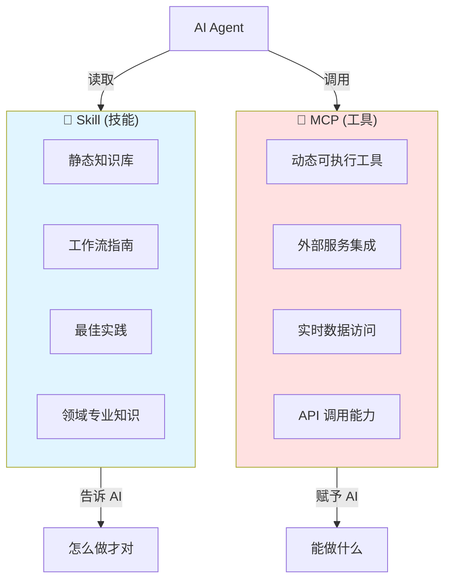
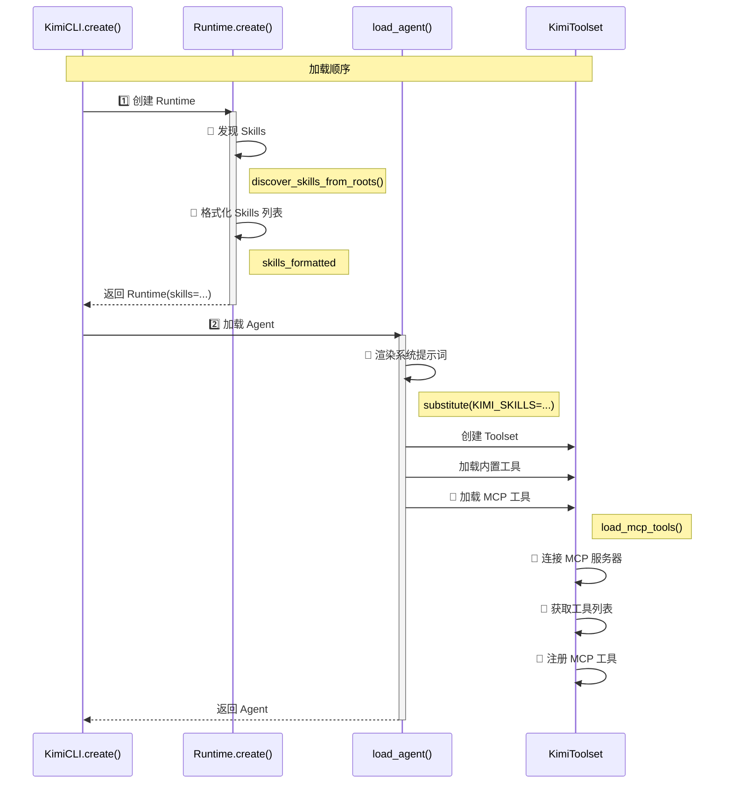
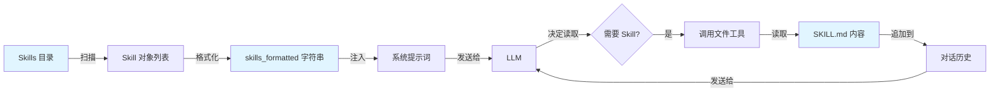
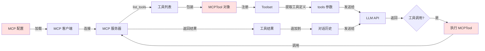

# 04 - Skill 与 MCP 对比分析与协同机制

## 学习目标

通过本文档，你将全面掌握：
1. Skill 和 MCP 的本质区别
2. 两者在系统中的定位和作用
3. 它们如何协同工作
4. 何时使用 Skill，何时使用 MCP
5. 实际代码层面的交互机制

---

## 一、核心概念对比

### 1.1 本质定义



**核心区别**：

| 维度 | Skill | MCP |
|------|-------|-----|
| **本质** | 知识和指导 | 工具和能力 |
| **类型** | 静态文档 | 动态程序 |
| **作用** | 教 AI "应该怎么做" | 让 AI "能够去做" |
| **执行** | 不可执行（仅文本） | 可执行（函数调用） |

---

### 1.2 形象比喻

想象你在做菜：

**🔵 Skill = 菜谱**
- 告诉你"如何做一道菜"
- 提供步骤、技巧、注意事项
- 但菜谱本身不能做菜

**🔴 MCP = 厨房工具**
- 刀、锅、烤箱等实际工具
- 让你能够"真正执行"操作
- 切菜、炒菜、烤蛋糕

**协同工作**：
1. 看菜谱（Skill）了解怎么做
2. 用工具（MCP）实际操作
3. 最终完成一道菜

---

## 二、系统架构中的位置

### 2.1 在 Runtime 中的存在形式

**文件**: `src/kimi_cli/soul/agent.py`

```python
@dataclass(slots=True, kw_only=True)
class Runtime:
    """Agent 运行时"""
    
    # ... 其他字段 ...
    
    # 🔵 Skills 以字典形式存储
    skills: dict[str, Skill]
    
    # 注意：MCP 不在 Runtime 中！
```

**文件**: `src/kimi_cli/soul/toolset.py`

```python
class KimiToolset:
    def __init__(self):
        # 🔴 内置工具 + MCP 工具都存在这里
        self._tool_dict: dict[str, ToolType] = {}
        
        # 🔴 MCP 服务器信息
        self._mcp_servers: dict[str, MCPServerInfo] = {}
```

**关键区别**：
- **Skill**: 存在 `Runtime.skills` 中
- **MCP**: 存在 `Toolset._tool_dict` 和 `Toolset._mcp_servers` 中

---

### 2.2 在 Agent 中的体现

**文件**: `src/kimi_cli/soul/agent.py`

```python
@dataclass(frozen=True, slots=True, kw_only=True)
class Agent:
    """加载后的 Agent"""
    
    name: str
    
    # 🔵 Skill 通过系统提示词体现
    system_prompt: str  # 包含 ${KIMI_SKILLS} 的渲染结果
    
    # 🔴 MCP 通过工具集体现
    toolset: Toolset  # 包含所有工具（内置 + MCP）
    
    # 🔵 Runtime 持有 Skills 字典
    runtime: Runtime  # runtime.skills
```

**可视化**：

```
Agent
├─ system_prompt (string)
│  └─ 包含: "## Available skills\n- skill1\n- skill2\n..."
│
├─ toolset (KimiToolset)
│  └─ _tool_dict
│     ├─ "read_file" (内置工具)
│     ├─ "shell" (内置工具)
│     ├─ "github_create_issue" (MCP 工具)
│     └─ "bigquery_query" (MCP 工具)
│
└─ runtime (Runtime)
   └─ skills
      ├─ "code-style" (Skill)
      └─ "git-commits" (Skill)
```

---

## 三、加载时机与流程对比

### 3.1 加载时序图



**关键时序**：

1. **Skill 加载**（早期）：
   - 时机: `Runtime.create()` 阶段
   - 目的: 准备系统提示词参数

2. **MCP 加载**（后期）：
   - 时机: `load_agent()` → `load_mcp_tools()`
   - 目的: 连接外部服务并获取工具

---

### 3.2 代码层面的加载对比

**Skill 加载**:

```python
# src/kimi_cli/soul/agent.py:L96-L124

# 阶段 1: 发现 Skills
skills_roots = [builtin_skills_dir, skills_dir]
skills = discover_skills_from_roots(skills_roots)  # ← 扫描目录
skills_by_name = index_skills(skills)              # ← 建立索引

# 阶段 2: 格式化为字符串
skills_formatted = "\n".join(
    f"- {skill.name}\n"
    f"  - Path: {skill.skill_md_file}\n"
    f"  - Description: {skill.description}"
    for skill in skills
)

# 阶段 3: 注入到 Runtime
runtime = Runtime(
    builtin_args=BuiltinSystemPromptArgs(
        KIMI_SKILLS=skills_formatted,  # ← 字符串
    ),
    skills=skills_by_name,            # ← 字典
)
```

**MCP 加载**:

```python
# src/kimi_cli/soul/agent.py:L246-L262

# 阶段 1: 验证配置
validated_mcp_configs: list[MCPConfig] = []
for mcp_config in mcp_configs:
    validated_mcp_configs.append(
        MCPConfig.model_validate(mcp_config)  # ← Pydantic 验证
    )

# 阶段 2: 异步加载工具
await toolset.load_mcp_tools(validated_mcp_configs, runtime)

# 内部流程:
# - 创建 MCP 客户端
# - 启动 MCP 服务器进程
# - 连接并获取工具列表
# - 包装为 MCPTool 并注册
```

**关键区别**：
- Skill: 同步、快速（只是读文件）
- MCP: 异步、耗时（需要启动进程/连接网络）

---

## 四、在系统提示词中的体现

### 4.1 Skill 的注入

**模板文件**: `src/kimi_cli/agents/default/system.md` (L98-L120)

```markdown
# Skills

Skills are reusable, composable capabilities that enhance your abilities.

## Available skills

${KIMI_SKILLS}  ← 替换点

## How to use skills

Identify the skills that are likely to be useful...
read the `SKILL.md` file for detailed instructions.
```

**渲染后**（AI 实际看到的）:

```markdown
# Skills

## Available skills

- code-style
  - Path: /home/user/.kimi/skills/code-style/SKILL.md
  - Description: 项目代码风格指南
- bigquery-analysis
  - Path: /home/user/.kimi/skills/bigquery-analysis/SKILL.md
  - Description: BigQuery 数据分析工作流

## How to use skills

Identify the skills that are likely to be useful...
```

---

### 4.2 MCP 的体现

**MCP 工具不在系统提示词中显式列出！**

它们通过 LLM 的 `tools` 参数传递：

```python
# src/kimi_cli/soul/kimisoul.py:L387-L394

result = await kosong.step(
    chat_provider,
    self._agent.system_prompt,  # ← 包含 Skills，不包含 MCP 工具列表
    self._agent.toolset,        # ← 包含所有工具（内置 + MCP）
    self._context.history,
    on_message_part=wire_send,
    on_tool_result=wire_send,
)
```

**kosong 内部**:

```python
# kosong 会调用 toolset.tools 获取工具列表
tools = [tool.base for tool in toolset._tool_dict.values()]

# 然后传递给 LLM API
llm_api.call(
    messages=history,
    tools=tools,  # ← 包含所有工具（内置 + MCP）
    ...
)
```

**关键区别**：
- **Skill**: 在系统提示词中**显式**列出（AI 主动看到）
- **MCP**: 在工具列表中**隐式**提供（LLM API 自动注入）

---

## 五、使用方式对比

### 5.1 Skill 的使用

#### 方式 1: AI 自主决定读取

```python
# 用户输入
user: "帮我创建一个符合规范的 Git 提交"

# AI 看到系统提示词中的 Skills 列表:
# - git-commits
#   - Description: Git 提交消息规范

# AI 决定读取 Skill
ai_thought: "我需要了解 Git 提交规范"

# AI 调用文件工具
tool_call: read_file(path="/home/user/.kimi/skills/git-commits/SKILL.md")

# 读取到 Skill 内容后，按照规范创建提交
```

#### 方式 2: 用户显式调用（斜杠命令）

```python
# 用户输入
user: "/skill:git-commits 修复了登录 bug"

# Skill 命令处理器 (src/kimi_cli/soul/kimisoul.py:L271-L281)
skill_text = read_skill_text(skill)  # 读取 SKILL.md
extra = "修复了登录 bug"
skill_text = f"{skill_text}\n\nUser request:\n{extra}"

# 将 Skill 内容作为用户消息发送
await soul._turn(Message(role="user", content=skill_text))
```

**关键**：Skill 最终都是通过**读取文本**的方式使用

---

### 5.2 MCP 的使用

#### 唯一方式: AI 调用工具

```python
# 用户输入
user: "在 GitHub 上创建一个 Issue"

# AI 看到 tools 列表中有:
# - github_create_issue (name, description, parameters)

# AI 决定调用工具
tool_call: github_create_issue(
    title="New feature request",
    body="...",
    repo="user/repo"
)

# Toolset 处理工具调用 (src/kimi_cli/soul/toolset.py:L91-L118)
tool = self._tool_dict["github_create_issue"]  # MCPTool 实例
result = await tool.call(arguments)

# MCPTool 内部 (src/kimi_cli/soul/toolset.py:L362-L387)
async with self._client as client:
    result = await client.call_tool(
        "github_create_issue",
        kwargs,
        timeout=self._timeout,
    )
    return convert_mcp_tool_result(result)
```

**关键**：MCP 工具通过**函数调用**的方式使用

---

## 六、协同工作机制

### 6.1 协同场景 1: Skill 指导 + MCP 执行

**场景**: 数据分析任务

```python
# 用户输入
user: "分析最近 7 天的用户增长趋势"

# ========== 第 1 步: AI 读取 Skill ==========
# AI 看到 Skills 列表中有 "bigquery-analysis"
# 决定读取 Skill 内容

tool_call_1: read_file(
    path="/home/user/.kimi/skills/bigquery-analysis/SKILL.md"
)

# SKILL.md 内容:
"""
## BigQuery 分析流程

1. 理解需求: 明确分析目标、时间范围
2. 设计查询:
   - 参考 references/schema.md 了解表结构
   - 使用 BigQuery MCP 工具执行查询  ← 指导使用 MCP
3. 数据处理: 清洗异常值、计算指标
4. 可视化: 生成图表
"""

# ========== 第 2 步: AI 按 Skill 指导读取 Schema ==========
tool_call_2: read_file(
    path="/home/user/.kimi/skills/bigquery-analysis/references/schema.md"
)

# ========== 第 3 步: AI 调用 MCP 工具 ==========
# Skill 告诉 AI 使用 "BigQuery MCP 工具"

tool_call_3: bigquery_query(
    sql="""
    SELECT DATE(created_at) as date, COUNT(*) as users
    FROM users
    WHERE created_at >= DATE_SUB(CURRENT_DATE(), INTERVAL 7 DAY)
    GROUP BY date
    ORDER BY date
    """
)

# MCP 工具执行，返回数据

# ========== 第 4 步: AI 按 Skill 指导生成可视化 ==========
# 使用内置工具生成图表...
```

**协同要点**：
1. 🔵 **Skill 提供分析框架**：告诉 AI 分析流程
2. 🔵 **Skill 提供 Schema 文档**：帮助 AI 写正确的 SQL
3. 🔴 **MCP 执行实际查询**：调用 BigQuery API
4. 🔵 **Skill 指导后续步骤**：数据处理、可视化

---

### 6.2 协同场景 2: Skill 规范 + MCP 操作

**场景**: 代码提交

```python
# 用户输入
user: "提交代码，已修复登录 bug"

# ========== 第 1 步: AI 读取 Skill ==========
tool_call_1: read_file(
    path="/home/user/.kimi/skills/git-commits/SKILL.md"
)

# SKILL.md 内容:
"""
## Git 提交规范

使用 Conventional Commits 格式:

type(scope): description

允许的 type: feat, fix, docs, style, refactor, test, chore

示例:
- fix(auth): 修复登录验证问题
"""

# ========== 第 2 步: AI 按规范格式化提交信息 ==========
# Skill 告诉 AI 提交格式应该是 "fix(auth): ..."

commit_message = "fix(auth): 修复登录验证问题"

# ========== 第 3 步: AI 调用 Shell 工具（或 Git MCP 工具）==========
tool_call_2: shell(command=f'git commit -m "{commit_message}"')

# 或者如果有 Git MCP 工具:
# tool_call_2: git_commit(message=commit_message)
```

**协同要点**：
1. 🔵 **Skill 定义规范**：Conventional Commits 格式
2. 🔵 **AI 理解并应用**：按规范格式化消息
3. 🔴 **MCP/内置工具执行**：实际执行 git commit

---

## 七、数据流对比

### 7.1 Skill 的数据流



**关键点**：
- Skill 内容通过**对话历史**传递给 LLM
- 每次读取都会消耗 context tokens

---

### 7.2 MCP 的数据流



**关键点**：
- MCP 工具定义通过 **tools 参数**传递（不占用 context）
- 工具执行结果追加到**对话历史**

---

## 八、关键代码交互点

### 8.1 Skill 读取的触发

**位置**: AI 的自主决策

```python
# AI 看到系统提示词:
"""
## Available skills
- code-style
  - Path: /home/user/.kimi/skills/code-style/SKILL.md
  - Description: 项目代码风格指南
"""

# AI 生成工具调用:
tool_calls = [
    {
        "name": "read_file",
        "arguments": {
            "path": "/home/user/.kimi/skills/code-style/SKILL.md"
        }
    }
]

# Kimi CLI 执行文件工具，读取 Skill 内容
# 内容被追加到对话历史
```

**没有专门的 "Skill 工具"**！Skill 通过普通的文件工具读取。

---

### 8.2 MCP 工具的调用

**位置**: `src/kimi_cli/soul/toolset.py`

```python
class KimiToolset:
    def handle(self, tool_call: ToolCall) -> HandleResult:
        """处理工具调用"""
        
        # 查找工具
        tool = self._tool_dict[tool_call.function.name]
        
        # 如果是 MCPTool
        if isinstance(tool, MCPTool):
            # MCPTool.__call__() 被调用
            # 内部会:
            # 1. 请求用户审批
            # 2. 调用 MCP 服务器
            # 3. 转换结果格式
            return await tool.call(arguments)
```

**MCP 工具有专门的包装器** (`MCPTool`)，处理审批、超时等逻辑。

---

## 九、何时使用 Skill vs MCP

### 9.1 使用 Skill 的场景

✅ **适合**：
- 代码规范和风格指南
- Git 提交消息规范
- 文档模板和写作标准
- 领域特定知识（公司业务逻辑、数据库 Schema）
- 多步骤工作流程（代码审查流程、部署清单）
- 最佳实践和检查清单

❌ **不适合**：
- 需要执行实际操作（用 MCP 工具）
- 需要实时数据（用 MCP 资源）
- 需要外部 API 调用（用 MCP 服务器）

---

### 9.2 使用 MCP 的场景

✅ **适合**：
- 外部服务集成（GitHub、Linear、Jira）
- 数据库查询（BigQuery、PostgreSQL）
- 文件系统操作（高级文件处理）
- API 调用（天气、翻译、搜索）
- 实时数据获取
- 需要认证的外部服务

❌ **不适合**：
- 纯知识传递（用 Skill）
- 静态指南和规范（用 Skill）
- 不需要执行的信息（用 Skill）

---

### 9.3 组合使用的场景

✨ **最佳实践**：

| 场景 | Skill 作用 | MCP 作用 |
|------|-----------|---------|
| **数据分析** | 分析框架、Schema 文档 | 执行 SQL 查询 |
| **代码提交** | 提交消息规范 | 执行 git commit |
| **文档生成** | 文档模板、写作规范 | 读取代码、写入文件 |
| **Issue 管理** | Issue 模板、分类规则 | GitHub/Jira API 调用 |

---

## 十、总结：Skill 和 MCP 的互补关系

### 10.1 核心差异总结

|  | Skill | MCP |
|---|-------|-----|
| **形态** | 📄 Markdown 文档 | ⚙️ 可执行程序 |
| **位置** | Runtime.skills | Toolset._tool_dict |
| **传递** | 系统提示词 | tools 参数 |
| **使用** | 读取文本 | 函数调用 |
| **消耗** | Context tokens | API 调用 |
| **速度** | 快（读文件） | 慢（网络/进程） |
| **加载** | 同步 | 异步 |

### 10.2 协同关系

```
┌─────────────────────────────────────────┐
│         Kimi CLI Agent                  │
├─────────────────────────────────────────┤
│                                         │
│  ┌──────────┐         ┌──────────┐    │
│  │  Skill   │         │   MCP    │    │
│  │          │         │          │    │
│  │ 告诉 AI  │◄───────►│ 让 AI   │    │
│  │ 怎么做   │  协同   │ 能去做   │    │
│  └──────────┘         └──────────┘    │
│      ↓                     ↓           │
│   知识注入             能力赋予        │
│                                         │
└─────────────────────────────────────────┘
```

### 10.3 设计哲学

**Skill**: "授人以渔"
- 教会 AI 正确的做事方法
- 提供领域知识和最佳实践
- 确保输出质量和一致性

**MCP**: "予人以鱼"
- 给予 AI 实际执行能力
- 连接外部服务和数据
- 扩展 AI 的行动边界

**结合**: "既授之以渔，又予之以鱼"
- Skill 定义标准，MCP 执行操作
- Skill 提供上下文，MCP 获取数据
- Skill 指导流程，MCP 完成步骤

---

## 十一、实战建议

### 建议 1: 优先使用 Skill

对于知识性内容，优先创建 Skill 而非 MCP 工具：

```markdown
# ✅ 好的做法
创建 Skill: ~/.kimi/skills/api-guidelines/SKILL.md
内容: API 设计规范、命名约定、错误处理等

# ❌ 不好的做法
创建 MCP 工具: api_guideline_checker
作用: 检查 API 是否符合规范

原因: 这是知识，不是执行能力
```

### 建议 2: 在 Skill 中引用 MCP

Skill 可以明确指导 AI 使用哪些 MCP 工具：

```markdown
# Skill: bigquery-analysis/SKILL.md

## 查询数据

使用 **BigQuery MCP 工具** 执行查询:
- 工具名: `bigquery_query`
- 参数: sql (查询语句)
- 注意: 查询超时时间为 30 秒
```

### 建议 3: 分层设计

```
Layer 1 (Skill): 领域知识 + 工作流
Layer 2 (MCP):   工具能力 + 数据访问
Layer 3 (AI):    决策 + 执行
```

---

**文档状态**: ✅ 已完成  
**下一步**: 实战案例 - 创建一个 Skill + MCP 协同的完整示例
