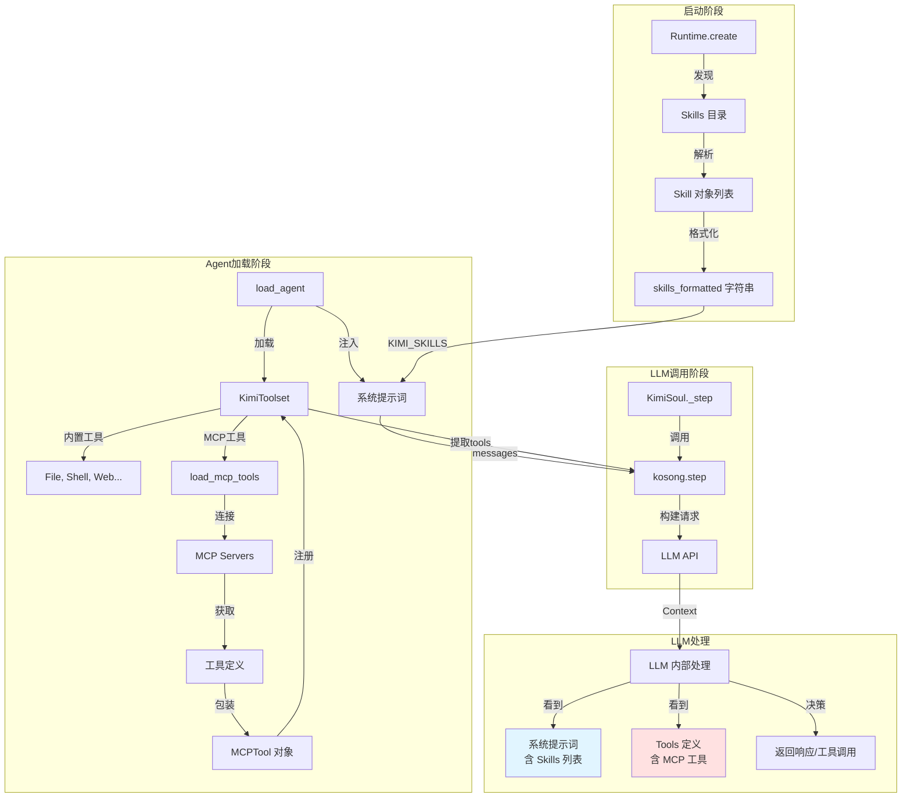

# 07 - Kimi CLI 中 Skill 和 MCP 的完整处理与使用机制（修订版）

## 前言

本文档基于**正确的 Context Window 理解**，重新全面解释 Kimi CLI 中 Skill 和 MCP 的处理机制。

**核心前提**（已纠正）：
- ✅ Skill 元数据会占用 Context Window
- ✅ MCP 工具定义也会占用 Context Window
- ✅ 两者都是文本 tokens，都会计费

---

## 一、整体架构回顾

### 1.1 在系统中的位置



---

## 二、Skill 的完整处理流程

### 2.1 阶段 1: 发现与加载

**时机**: `Runtime.create()` 阶段（启动早期）

**代码**: `src/kimi_cli/soul/agent.py` (L96-L124)

```python
# 1. 确定搜索路径
builtin_skills_dir = get_builtin_skills_dir()  # 内置
skills_dir = get_skills_dir()                   # 用户 ~/.kimi/skills
skills_roots = [builtin_skills_dir, skills_dir]

# 2. 扫描并解析
skills = discover_skills_from_roots(skills_roots)  # 返回 list[Skill]
skills_by_name = index_skills(skills)              # 转为 dict[str, Skill]

# 3. 格式化为文本
skills_formatted = "\n".join(
    f"- {skill.name}\n"
    f"  - Path: {skill.skill_md_file}\n"
    f"  - Description: {skill.description}"
    for skill in skills
)
```

**输出示例**:
```markdown
- code-style
  - Path: /home/user/.kimi/skills/code-style/SKILL.md
  - Description: 项目代码风格指南
- git-commits
  - Path: /home/user/.kimi/skills/git-commits/SKILL.md
  - Description: Git 提交消息规范
```

**Token 消耗**: 
- 每个 Skill: ~50-100 tokens
- 5 个 Skills: ~250-500 tokens

---

### 2.2 阶段 2: 注入系统提示词

**时机**: `load_agent()` → `_load_system_prompt()` 阶段

**代码**: `src/kimi_cli/soul/agent.py` (L272-L282)

```python
def _load_system_prompt(
    path: Path,
    args: dict[str, str],
    builtin_args: BuiltinSystemPromptArgs
) -> str:
    # 读取模板
    system_prompt = path.read_text(encoding="utf-8").strip()
    
    # 替换变量
    return string.Template(system_prompt).substitute(
        asdict(builtin_args),  # 包含 KIMI_SKILLS=skills_formatted
        **args
    )
```

**模板**: `src/kimi_cli/agents/default/system.md` (L98-L120)

```markdown
# Skills

...

## Available skills

${KIMI_SKILLS}  ← 被替换为 skills_formatted

## How to use skills

Identify the skills that are likely to be useful...
read the `SKILL.md` file for detailed instructions.
```

**渲染后**（实际发送给 LLM 的内容）:

```markdown
# Skills

## Available skills

- code-style
  - Path: /home/user/.kimi/skills/code-style/SKILL.md
  - Description: 项目代码风格指南
- git-commits
  - Path: /home/user/.kimi/skills/git-commits/SKILL.md
  - Description: Git 提交消息规范

## How to use skills

Identify the skills that are likely to be useful...
```

**关键**: 
- ✅ 这些内容会出现在**每次 LLM 调用**的系统提示词中
- ✅ 占用 Context Window
- ✅ 计入 Input Tokens 费用

---

### 2.3 阶段 3: 使用 Skill

**方式 1: AI 自主读取**

```python
# 用户输入
user: "帮我写一个符合规范的 Git 提交"

# LLM 看到系统提示词中的 Skills 列表
# 决定读取 git-commits Skill

# LLM 生成工具调用
tool_call = {
    "name": "read_file",  # 使用普通的文件工具
    "arguments": {
        "path": "/home/user/.kimi/skills/git-commits/SKILL.md"
    }
}

# Kimi CLI 执行文件读取
skill_content = """
---
name: git-commits
description: Git 提交消息规范
---

## Git 提交规范

使用 Conventional Commits 格式:
type(scope): description

允许的 type: feat, fix, docs, ...
"""

# 这个内容被追加到对话历史
# 再次调用 LLM，LLM 按照 Skill 指导生成提交消息
```

**方式 2: 用户显式调用（斜杠命令）**

**代码**: `src/kimi_cli/soul/kimisoul.py` (L268-L284)

```python
def _make_skill_command(self, skill: Skill):
    async def _run_skill(soul: KimiSoul, args: str, *, _skill: Skill = skill):
        # 读取 SKILL.md
        skill_text = read_skill_text(_skill)
        
        # 如果用户提供额外参数
        extra = args.strip()
        if extra:
            skill_text = f"{skill_text}\n\nUser request:\n{extra}"
        
        # 将 Skill 内容作为用户消息发送
        await soul._turn(Message(role="user", content=skill_text))
    
    return _run_skill

# 用户输入: /skill:git-commits 修复登录 bug
# 效果: 将 SKILL.md 内容 + "修复登录 bug" 作为用户消息
```

**Token 消耗**:
- Skill 元数据: 系统提示词中（每次调用）
- Skill 完整内容: 对话历史中（仅读取时）
- 一个完整 Skill: ~1000-3000 tokens

---

## 三、MCP 的完整处理流程

### 3.1 阶段 1: 配置准备

**配置来源**:
```bash
# 方式 1: 命令行
kimi mcp add --transport stdio github -- npx github-mcp-server

# 方式 2: 配置文件
kimi --mcp-config-file ~/.config/mcp.json

# 方式 3: 用户配置目录
~/.kimi/mcp-config.toml
```

**配置格式**:
```json
{
  "mcpServers": {
    "github": {
      "command": "npx",
      "args": ["-y", "github-mcp-server"],
      "env": {"GITHUB_TOKEN": "ghp_xxx"}
    },
    "bigquery": {
      "url": "https://mcp.example.com/bigquery",
      "headers": {"API_KEY": "xxx"}
    }
  }
}
```

---

### 3.2 阶段 2: 加载 MCP 工具

**时机**: `load_agent()` → `load_mcp_tools()` 阶段

**代码**: `src/kimi_cli/soul/toolset.py` (L176-L307)

```python
async def load_mcp_tools(
    self,
    mcp_configs: list[MCPConfig],
    runtime: Runtime,
    in_background: bool = True
):
    # 为每个 MCP 服务器创建客户端
    for mcp_config in mcp_configs:
        for server_name, server_config in mcp_config.mcpServers.items():
            # 创建 MCP 客户端
            client = fastmcp.Client(MCPConfig(mcpServers={server_name: server_config}))
            
            # 保存服务器信息
            self._mcp_servers[server_name] = MCPServerInfo(
                status="pending",
                client=client,
                tools=[]
            )
    
    # 异步连接所有服务器
    async def _connect():
        tasks = [
            _connect_server(server_name, server_info)
            for server_name, server_info in self._mcp_servers.items()
        ]
        await asyncio.gather(*tasks)
    
    if in_background:
        self._mcp_loading_task = asyncio.create_task(_connect())
    else:
        await _connect()
```

**连接单个服务器**:

```python
async def _connect_server(server_name: str, server_info: MCPServerInfo):
    server_info.status = "connecting"
    
    try:
        # 连接 MCP 服务器
        async with server_info.client as client:
            # 🔴 关键: 获取服务器提供的工具列表
            for tool in await client.list_tools():
                # 包装为 MCPTool
                server_info.tools.append(
                    MCPTool(server_name, tool, client, runtime=runtime)
                )
        
        # 注册所有工具到 Toolset
        for tool in server_info.tools:
            self.add(tool)  # self._tool_dict[tool.name] = tool
        
        server_info.status = "connected"
    except Exception as e:
        server_info.status = "failed"
        raise MCPRuntimeError(f"Failed to connect: {e}")
```

**执行示例**:

```python
# client.list_tools() 返回:
# [
#     Tool(name="github_create_issue", description="...", inputSchema={...}),
#     Tool(name="github_list_repos", description="...", inputSchema={...})
# ]

# 包装为 MCPTool:
# self._tool_dict = {
#     "github_create_issue": MCPTool(...),
#     "github_list_repos": MCPTool(...)
# }
```

---

### 3.3 阶段 3: 提取工具定义

**时机**: `KimiSoul._step()` → `kosong.step()`

**代码**: `src/kimi_cli/soul/kimisoul.py` (L387-L394)

```python
result = await kosong.step(
    chat_provider,
    self._agent.system_prompt,  # 系统提示词（含 Skills）
    self._agent.toolset,        # 工具集（含 MCP 工具）
    self._context.history,
    ...
)
```

**kosong 内部处理**:

```python
# kosong/step.py (简化)

async def step(chat_provider, system_prompt, toolset, history, ...):
    # 提取工具定义
    tools = toolset.tools  # 调用 KimiToolset.tools 属性
    
    # 调用 LLM API
    response = await chat_provider.call(
        messages=[
            {"role": "system", "content": system_prompt},
            *history
        ],
        tools=tools,  # 🔴 传递工具定义
        ...
    )
```

**KimiToolset.tools 属性**:

```python
# src/kimi_cli/soul/toolset.py (L87-L89)

@property
def tools(self) -> list[Tool]:
    return [tool.base for tool in self._tool_dict.values()]

# 返回:
# [
#     Tool(name="read_file", description="...", parameters={...}),
#     Tool(name="shell", description="...", parameters={...}),
#     Tool(name="github_create_issue", description="...", parameters={...}),
#     ...
# ]
```

---

### 3.4 阶段 4: 传递给 LLM

**LLM API 请求**（OpenAI 格式）:

```json
{
  "model": "gpt-4-turbo",
  "messages": [
    {
      "role": "system",
      "content": "You are Kimi CLI...\n\n## Available skills\n- code-style\n  - Path: ...\n..."
    },
    {
      "role": "user",
      "content": "在 GitHub 创建一个 Issue"
    }
  ],
  "tools": [
    {
      "type": "function",
      "function": {
        "name": "github_create_issue",
        "description": "This is an MCP tool from MCP server `github`.\n\nCreate a new issue in a GitHub repository",
        "parameters": {
          "type": "object",
          "properties": {
            "repo": {"type": "string", "description": "Repository name"},
            "title": {"type": "string"},
            "body": {"type": "string"}
          },
          "required": ["repo", "title"]
        }
      }
    },
    {
      "type": "function",
      "function": {
        "name": "read_file",
        "description": "Read file content",
        "parameters": {...}
      }
    }
    // ... 其他工具
  ]
}
```

**关键理解**:
- ✅ `tools` 参数的内容会被 LLM API 后台**注入到上下文**
- ✅ 占用 Context Window
- ✅ 计入 Input Tokens

**Token 消耗估算**:
```
假设有 20 个工具:
- 每个工具定义: ~150 tokens
- 总计: 20 × 150 = 3000 tokens

加上系统提示词（含 Skills）: ~2000 tokens
总 overhead: ~5000 tokens
```

---

### 3.5 阶段 5: 调用 MCP 工具

**LLM 返回**:

```json
{
  "tool_calls": [
    {
      "id": "call_abc123",
      "type": "function",
      "function": {
        "name": "github_create_issue",
        "arguments": "{\"repo\": \"user/repo\", \"title\": \"New feature\", \"body\": \"...\"}"
      }
    }
  ]
}
```

**Kimi CLI 处理**:

```python
# src/kimi_cli/soul/toolset.py (L91-L118)

def handle(self, tool_call: ToolCall) -> HandleResult:
    # 查找工具
    tool = self._tool_dict["github_create_issue"]  # MCPTool 实例
    
    # 解析参数
    arguments = json.loads(tool_call.function.arguments)
    
    # 调用工具
    async def _call():
        result = await tool.call(arguments)
        return ToolResult(tool_call_id=tool_call.id, return_value=result)
    
    return asyncio.create_task(_call())
```

**MCPTool 执行**:

```python
# src/kimi_cli/soul/toolset.py (L362-L387)

class MCPTool:
    async def __call__(self, **kwargs):
        # 1. 请求用户审批（如果需要）
        if not await self._runtime.approval.request(...):
            return ToolRejectedError()
        
        # 2. 调用 MCP 服务器
        async with self._client as client:
            result = await client.call_tool(
                self._mcp_tool.name,  # "github_create_issue"
                kwargs,               # {"repo": "...", "title": "..."}
                timeout=self._timeout,
            )
            return convert_mcp_tool_result(result)
```

**工具结果**:

```python
# 返回:
ToolOk(output=[
    TextPart(text="Issue created: https://github.com/user/repo/issues/123")
])

# 追加到对话历史:
{
    "role": "tool",
    "tool_call_id": "call_abc123",
    "content": "Issue created: https://github.com/user/repo/issues/123"
}
```

**Token 消耗**:
- tool_call: ~100 tokens
- tool_result: ~50 tokens
- 总计: ~150 tokens（每次调用）

---

## 四、完整对比总结

### 4.1 处理流程对比

| 阶段 | Skill | MCP |
|------|-------|-----|
| **发现** | Runtime.create() 扫描目录 | load_mcp_tools() 连接服务器 |
| **格式化** | 转为 Markdown 文本 | 保持 JSON Schema |
| **存储** | Runtime.skills (dict) | Toolset._tool_dict (dict) |
| **传递** | 注入系统提示词 | tools 参数（后台注入）|
| **占用 Context** | ✅ 元数据在系统提示词 | ✅ 定义在 tools（仍占用）|
| **使用** | AI 调用文件工具读取 | AI 调用 MCP 工具 |

---

### 4.2 Token 消耗对比

**场景**: 5 个 Skills + 20 个 MCP 工具

| 项目 | Skill | MCP | 总计 |
|------|-------|-----|------|
| **元数据（每次调用）** | ~500 tokens | ~3000 tokens | **3500 tokens** |
| **完整内容（按需）** | ~2000 tokens/个 | ~150 tokens/次 | 按使用计 |

**优化建议**:
1. **Skill**: 精简描述，控制数量（<10 个）
2. **MCP**: 
   - 使用 Prompt Caching（降低重复费用）
   - 动态工具选择（减少工具数量）
   - 精简工具定义（去除冗余）

---

### 4.3 使用场景对比

| 使用场景 | 推荐 Skill | 推荐 MCP |
|---------|-----------|---------|
| 代码规范 | ✅ | ❌ |
| Git 提交规范 | ✅ | ❌ |
| 数据库 Schema | ✅ | ❌ |
| 分析框架 | ✅ | ❌ |
| GitHub 操作 | ❌ | ✅ |
| 数据库查询 | ❌ | ✅ |
| API 调用 | ❌ | ✅ |
| 文件系统操作 | ❌ | ✅ |
| **组合使用** | ✅ 提供指导 | ✅ 执行操作 |

---

## 五、协同使用示例

### 场景: BigQuery 数据分析

**Skill 提供**:
```markdown
# bigquery-analysis/SKILL.md

## 分析流程
1. 理解用户需求
2. 参考 references/schema.md 设计 SQL
3. 使用 BigQuery MCP 工具执行查询
4. 处理数据并生成可视化
```

**MCP 提供**:
```json
{
  "name": "bigquery_query",
  "description": "Execute BigQuery SQL",
  "parameters": {
    "sql": {"type": "string"},
    "project": {"type": "string"}
  }
}
```

**执行流程**:

```python
# 用户输入
user: "分析最近 7 天的用户增长"

# Step 1: AI 读取 Skill
tool_call_1 = read_file("bigquery-analysis/SKILL.md")
# Context 增加: ~1500 tokens

# Step 2: AI 读取 Schema
tool_call_2 = read_file("bigquery-analysis/references/schema.md")
# Context 增加: ~2000 tokens

# Step 3: AI 调用 MCP 工具
tool_call_3 = bigquery_query(sql="SELECT ...")
# Context 增加: ~150 tokens（调用 + 结果）

# Step 4: AI 生成分析报告
# 基于 Skill 指导 + MCP 数据
```

**Token 总消耗**:
```
系统提示词（含 Skills 元数据）: 2000
Tools 定义（含 MCP 工具）:      3000
对话历史:                        500
Skill 完整内容:                 3500
MCP 调用:                        150
--------------------------------------
总计:                           9150 tokens
```

---

## 六、优化建议

### 6.1 Skill 优化

1. **精简元数据**
   ```markdown
   # ❌ 冗长
   - Description: 这是一个用于 BigQuery 数据分析的完整工作流程，包含查询设计、数据处理、结果可视化等多个步骤...
   
   # ✅ 简洁
   - Description: BigQuery 数据分析工作流
   ```

2. **控制数量**
   - 建议: <10 个 Skills
   - 超过后考虑合并相关 Skills

3. **渐进式披露**
   - SKILL.md 简洁（<500 行）
   - 详细内容放 references/

---

### 6.2 MCP 优化

1. **Prompt Caching**（最有效）
   
   **Anthropic 示例**:
   ```python
   # 标记 tools 为可缓存
   response = anthropic.messages.create(
       model="claude-3-5-sonnet-20241022",
       messages=[...],
       system=[
           {"type": "text", "text": system_prompt},
           {"type": "text", "text": json.dumps(tools), "cache_control": {"type": "ephemeral"}}
       ]
   )
   ```
   
   **效果**:
   - 首次: 正常计费
   - 后续: ~10% 费用（如果 tools 未变）

2. **动态工具选择**
   
   ```python
   def select_tools(user_query: str, all_tools: list[Tool]) -> list[Tool]:
       # 使用向量相似度或简单关键词匹配
       relevant = []
       for tool in all_tools:
           if is_relevant(user_query, tool):
               relevant.append(tool)
       return relevant[:10]  # 最多 10 个
   ```

3. **精简工具定义**
   
   ```json
   {
     "name": "create_issue",
     "description": "Create GitHub issue",
     "parameters": {
       "type": "object",
       "properties": {
         "repo": {"type": "string"},
         "title": {"type": "string"}
       },
       "required": ["repo", "title"]
     }
   }
   ```

---

## 七、总结

### 核心要点

1. **Skill 和 MCP 都占用 Context Window**
   - Skill: 元数据在系统提示词
   - MCP: 定义通过 tools 参数（仍占用）

2. **传递方式不同**
   - Skill: 显式（AI 可见）
   - MCP: 隐式（后台注入）

3. **使用方式不同**
   - Skill: AI 主动读取（文件工具）
   - MCP: AI 按需调用（工具调用）

4. **优化策略**
   - Skill: 精简、控制数量
   - MCP: Caching、动态选择、精简定义

### 设计哲学

- **Skill**: 知识注入，指导 AI "应该怎么做"
- **MCP**: 能力赋予，让 AI "能够去做"
- **组合**: 知识 + 能力 = 完整解决方案

---

**文档状态**: ✅ 完成（基于正确理解）  
**替代文档**: 04, 05（部分内容已过时）  
**建议**: 以本文档为准
