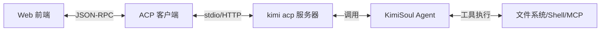
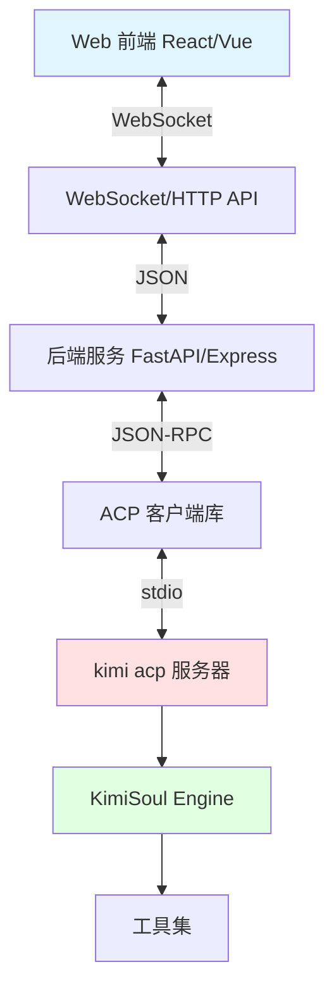

# Agent 框架 Web 界面对接指南

> 基于 kimi-cli 项目的 UI 模式分析  
> 生成时间：2026-01-26

---

## ✅ 推荐方案：使用 ACP 模式

如果需要将 Agent 框架对接到 Web 界面，**推荐使用 ACP 模式**（Agent Client Protocol）。

---

## 📋 kimi-cli 的四种 UI 模式对比

| 模式 | 触发方式 | 适用场景 | Web 对接 |
|------|---------|---------|---------|
| **shell** | 默认模式 | 交互式终端 | ❌ 不适合 |
| **print** | `--print` | 脚本/批处理 | ❌ 不适合 |
| **ACP** | `kimi acp` | IDE/编辑器集成 | ✅ **推荐** |
| **wire** | `--wire` | 自定义客户端 | ✅ 可选 |

---

## 🎯 ACP 模式详解

### 什么是 ACP？

**ACP**（Agent Client Protocol）是一个开放的协议标准，用于连接 AI Agent 和客户端（IDE、编辑器、Web 界面等）。

- **官方规范**：https://github.com/agentclientprotocol/agent-client-protocol
- **kimi-cli 实现**：`src/kimi_cli/ui/acp/`
- **已支持的客户端**：Zed、JetBrains IDE

### ACP 架构



### 启动 ACP 服务器

```bash
# 方式 1：直接启动
kimi acp

# 方式 2：通过配置启动（旧方式，已废弃）
kimi --acp
```

### ACP 服务器特点

✅ **基于标准协议**
- JSON-RPC 2.0 通信
- 标准化的消息格式
- 良好的生态支持

✅ **完整的会话管理**
- 支持多会话
- 会话持久化
- 会话切换

✅ **流式响应**
- 实时返回 Agent 输出
- 支持长时间运行任务
- 进度反馈

✅ **工具支持**
- 内置工具（文件、Shell、Web）
- MCP 工具集成
- 自定义工具

---

## 🛠️ Web 界面对接方案

### 方案 A：通过 ACP 客户端库对接（推荐）

**架构**：
```
Web 前端 → 后端 API → ACP 客户端 → kimi acp 服务器 → Agent
```

**实现步骤**：

1. **启动 kimi acp 服务器**
   ```python
   # 后端启动 subprocess
   import subprocess
   
   acp_process = subprocess.Popen(
       ["kimi", "acp"],
       stdin=subprocess.PIPE,
       stdout=subprocess.PIPE,
       stderr=subprocess.PIPE
   )
   ```

2. **实现 ACP 客户端**
   - 使用 Python `acp` 库（安装：`pip install acp`）
   - 或使用其他语言的 ACP 客户端库

3. **Web API 桥接**
   ```python
   from fastapi import FastAPI, WebSocket
   import acp
   
   app = FastAPI()
   
   @app.websocket("/ws/agent")
   async def websocket_endpoint(websocket: WebSocket):
       await websocket.accept()
       
       # 连接到 ACP 服务器
       async with acp.connect_stdio(acp_process) as client:
           # 初始化
           await client.initialize(...)
           
           # 创建会话
           session = await client.new_session(...)
           
           # 接收前端消息
           while True:
               data = await websocket.receive_json()
               
               # 发送给 Agent
               async for msg in client.prompt(data["message"], session.id):
                   # 转发给前端
                   await websocket.send_json(msg.dict())
   ```

4. **前端 WebSocket 客户端**
   ```javascript
   const ws = new WebSocket('ws://localhost:8000/ws/agent');
   
   ws.onmessage = (event) => {
       const message = JSON.parse(event.data);
       // 渲染 Agent 响应
       renderAgentMessage(message);
   };
   
   // 发送用户消息
   function sendMessage(text) {
       ws.send(JSON.stringify({
           message: text
       }));
   }
   ```

**示例配置**（参考 Zed/JetBrains）：
```json
{
  "agent_servers": {
    "Kimi CLI": {
      "command": "kimi",
      "args": ["acp"],
      "env": {}
    }
  }
}
```

---

### 方案 B：直接使用 Wire 协议（高级）

**架构**：
```
Web 前端 → 后端 WebSocket → Wire 服务器 → Agent
```

**特点**：
- 更底层的协议
- 更灵活的定制
- 需要自己实现客户端

**启动 Wire 服务器**：
```bash
kimi --wire
```

**实现代码示例**：
```python
# 参考：examples/kimi-cli-wire-messages/
from kimi_cli.wire import WireMessage
import asyncio

async def connect_to_wire():
    # 启动 wire 进程
    proc = await asyncio.create_subprocess_exec(
        "kimi", "--wire",
        stdin=asyncio.subprocess.PIPE,
        stdout=asyncio.subprocess.PIPE
    )
    
    # 读取 Wire 消息
    while True:
        line = await proc.stdout.readline()
        msg = WireMessage.parse_raw(line)
        # 处理消息
        handle_message(msg)
```

**Wire 消息类型**（`src/kimi_cli/wire/types.py`）：
- `UserMessage` - 用户输入
- `AssistantMessage` - Agent 回复
- `ToolCallMessage` - 工具调用
- `ApprovalRequest` - 审批请求
- `StatusMessage` - 状态更新

---

## 💡 推荐架构图

### 完整的 Web 集成架构



---

## 📝 实现步骤总结

### Step 1: 准备环境

```bash
# 安装 kimi-cli
pip install kimi-cli

# 安装 ACP 客户端库
pip install acp

# 测试 ACP 服务器
kimi acp
```

### Step 2: 后端实现

选择后端框架：
- **Python**: FastAPI + `acp` 库
- **Node.js**: Express + `acp-client` 库
- **Go**: 使用 ACP JSON-RPC 协议

核心功能：
1. 启动和管理 `kimi acp` 进程
2. 实现 ACP 客户端连接
3. 提供 WebSocket/HTTP API
4. 消息格式转换

### Step 3: 前端实现

技术栈：
- React/Vue/Svelte
- WebSocket 客户端
- Markdown 渲染（Agent 消息）
- 代码高亮（工具调用结果）

核心功能：
1. WebSocket 连接管理
2. 消息流式渲染
3. 工具调用可视化
4. 审批请求交互

### Step 4: 部署

考虑因素：
- **进程管理**: 使用 supervisor/systemd 管理 `kimi acp`
- **并发**: 每个用户一个 ACP 会话
- **安全**: API 认证、工具权限控制
- **监控**: 日志、性能指标

---

## 🔍 参考实现

### 官方示例

1. **kimi-cli-wire-messages**（`examples/kimi-cli-wire-messages/`）
   - 演示如何使用 Wire 协议
   - Python 实现

2. **Zed 编辑器集成**
   - 通过 ACP 集成 kimi-cli
   - 配置文件：`~/.config/zed/settings.json`

3. **JetBrains IDE 集成**
   - ACP 客户端实现
   - 配置文件：`~/.jetbrains/acp.json`

### 相关代码

| 文件 | 说明 |
|------|------|
| `src/kimi_cli/ui/acp/__init__.py` | ACP 服务器实现 |
| `src/kimi_cli/ui/wire/__init__.py` | Wire 协议实现 |
| `src/kimi_cli/acp/` | ACP 类型定义 |
| `src/kimi_cli/wire/types.py` | Wire 消息类型 |

---

## ⚠️ 注意事项

### 1. 版本兼容性

- kimi-cli 的 ACP 实现基于最新的 ACP 规范
- 确保使用相同版本的 `acp` 库

### 2. 会话管理

```python
# 每个 Web 用户应该有独立的会话
session_map = {}

async def get_or_create_session(user_id):
    if user_id not in session_map:
        session = await acp_client.new_session(...)
        session_map[user_id] = session
    return session_map[user_id]
```

### 3. 安全考虑

⚠️ **工具执行风险**
- Shell 工具可以执行任意命令
- 文件工具可以读写文件
- 建议启用 **Approval 机制**（非 YOLO 模式）

```bash
# 不要自动批准
kimi acp  # 默认需要审批

# 危险：自动批准所有操作
kimi acp --yolo  # ⚠️ 不推荐用于 Web
```

### 4. 性能优化

- **连接池**: 复用 ACP 连接
- **异步处理**: 使用异步 I/O
- **流式返回**: 利用 ACP 的流式特性

---

## 🎯 总结

| 方案 | 优势 | 劣势 | 推荐度 |
|------|------|------|--------|
| **ACP** | 标准协议、生态完善、易于集成 | 需要额外的客户端库 | ⭐⭐⭐⭐⭐ |
| **Wire** | 灵活、底层控制 | 需要自己实现客户端 | ⭐⭐⭐ |
| **自定义** | 完全控制 | 工作量大 | ⭐⭐ |

**最佳实践**：
1. ✅ 使用 ACP 作为主要方案
2. ✅ 后端使用 FastAPI + WebSocket
3. ✅ 前端使用流式渲染
4. ✅ 启用审批机制保证安全
5. ✅ 参考 Zed/JetBrains 的集成方式

---

**快速开始**：

```bash
# 1. 启动 ACP 服务器
kimi acp

# 2. 在另一个终端测试连接
python -c "import acp; import asyncio; asyncio.run(acp.test_connection())"

# 3. 开始开发 Web 前端和后端
```

有问题可以参考：
- [官方文档](https://moonshotai.github.io/kimi-cli)
- [ACP 规范](https://github.com/agentclientprotocol/agent-client-protocol)
- [示例代码](file:///opt/script/kimi-cli/examples)
