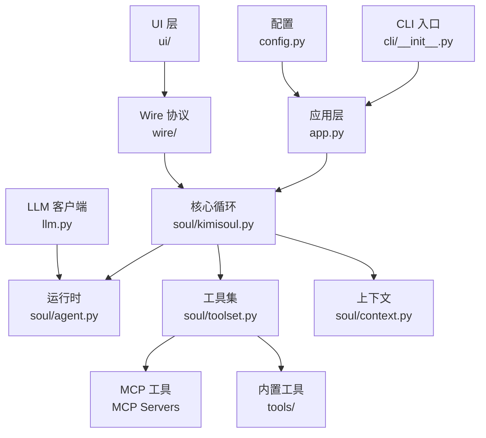
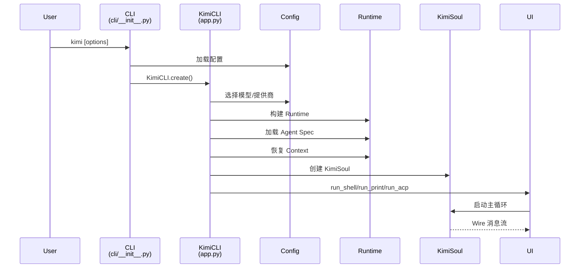
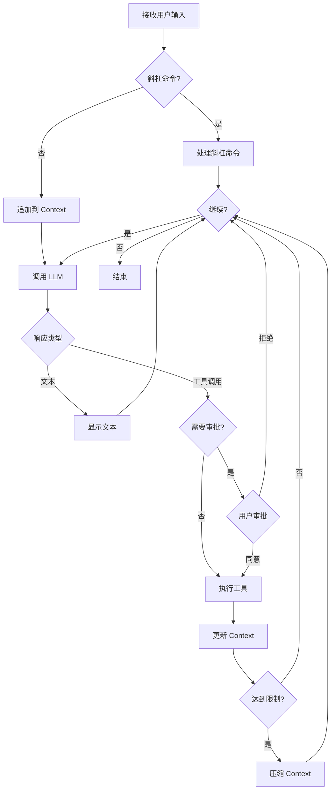

# Kimi CLI 学习与二次开发计划

## 项目概览

Kimi CLI 是一个运行在终端中的 AI 代理，帮助完成软件开发任务和终端操作。它能够读写代码、执行 shell 命令、搜索和获取网页，并在执行过程中自主规划和调整动作。

### 核心信息

- **版本**: 0.75
- **Python 版本要求**: ≥3.12（工具配置使用 3.14）
- **状态**: 技术预览版
- **开发者**: MoonshotAI
- **仓库**: https://github.com/MoonshotAI/kimi-cli

## 技术栈

### 核心框架
- **Python 3.12+** - 主要编程语言
- **Typer** - CLI 框架
- **asyncio** - 异步运行时
- **kosong** - LLM 框架（workspace 内部依赖）
- **fastmcp** - MCP 集成
- **loguru** - 日志记录

### 构建与工具
- **uv + uv_build** - 包管理和构建
- **PyInstaller** - 独立二进制构建
- **pytest + pytest-asyncio** - 测试框架
- **ruff** - 代码检查和格式化
- **pyright + ty** - 类型检查

### 主要依赖
```toml
agent-client-protocol==0.7.0  # ACP 协议支持
aiohttp==3.13.3               # 异步 HTTP
prompt-toolkit==3.0.52        # 交互式提示
rich==14.2.0                  # 终端美化
fastmcp==2.12.5               # MCP 协议
pydantic==2.12.5              # 数据验证
```

## 架构分析

### 1. 核心架构层级



### 2. 目录结构详解

#### `/src/kimi_cli/` - 核心源码
```
src/kimi_cli/
├── cli/              # CLI 命令行入口
│   ├── __init__.py   # 主命令：kimi
│   ├── mcp.py        # MCP 子命令管理
│   └── info.py       # 信息命令
├── soul/             # 核心代理逻辑
│   ├── kimisoul.py   # 主循环
│   ├── agent.py      # Runtime/Agent/LaborMarket
│   ├── toolset.py    # 工具加载与执行
│   ├── context.py    # 对话历史
│   ├── approval.py   # 用户审批机制
│   ├── compaction.py # 上下文压缩
│   └── slash.py      # 斜杠命令
├── tools/            # 内置工具
│   ├── shell/        # Shell 命令
│   ├── file/         # 文件操作
│   ├── web/          # Web 搜索
│   ├── multiagent/   # 子代理任务
│   └── ...
├── ui/               # 用户界面
│   ├── shell/        # 交互式 Shell UI
│   ├── print/        # 打印模式
│   ├── acp/          # ACP 服务器
│   └── wire/         # Wire 协议 UI
├── wire/             # Soul 与 UI 间的事件传输
├── acp/              # ACP 服务器组件
├── agents/           # 内置代理 YAML 规范
├── prompts/          # 共享提示词模板
├── skills/           # 技能定义
├── app.py            # KimiCLI 主类
├── config.py         # 配置管理
├── llm.py            # LLM 提供商选择
├── agentspec.py      # Agent 规范加载
└── utils/            # 工具函数
```

#### `/packages/` - Workspace 依赖
```
packages/
├── kosong/           # LLM 框架
└── kaos/             # 工具包
```

#### `/docs/` - 文档
#### `/tests/` 和 `/tests_ai/` - 测试套件
#### `/examples/` - 示例代码

### 3. 执行流程

#### 启动流程


#### 主循环流程


### 4. 关键模块深入分析

#### A. Agent Specs（代理规范）
- 位置: `src/kimi_cli/agents/`
- 格式: YAML
- 功能:
  - 定义代理行为
  - 选择工具集
  - 配置子代理
  - 系统提示词
- 支持继承（`extend` 字段）
- 内置参数注入:
  - `KIMI_NOW` - 当前时间
  - `KIMI_WORK_DIR` - 工作目录
  - `KIMI_WORK_DIR_LS` - 目录列表
  - `KIMI_AGENTS_MD` - 代理文档
  - `KIMI_SKILLS` - 技能列表

#### B. Toolset（工具集系统）
- 位置: `src/kimi_cli/soul/toolset.py`
- 功能:
  - 按导入路径加载工具
  - 依赖注入
  - 执行工具调用
  - MCP 工具桥接

**内置工具分类**:
```
tools/
├── shell/        # Shell 命令执行
├── file/         # 文件读写操作
├── web/          # Web 搜索和抓取
├── todo/         # TODO 管理
├── multiagent/   # 任务分发（子代理）
├── dmail/        # DMail 检查点回复
└── think/        # 思考工具
```

**MCP 工具**:
- 通过 `fastmcp` 加载
- CLI 管理: `kimi mcp` 子命令
- 存储位置: `~/.kimi/`
- 支持类型:
  - stdio 服务器
  - HTTP 服务器
  - OAuth 授权

#### C. Subagents（子代理）
- 管理器: `LaborMarket` (soul/agent.py)
- 类型:
  - **固定子代理**: Agent Spec 中预定义
  - **动态子代理**: 运行时创建
- 调用方式: Task 工具 (tools/multiagent/)

#### D. Context（上下文管理）
- 位置: `src/kimi_cli/soul/context.py`
- 功能:
  - 对话历史管理
  - Checkpoint 支持（DMail 使用）
  - 上下文压缩（compaction.py）

#### E. Wire 协议
- 位置: `src/kimi_cli/wire/`
- 作用: Soul 与 UI 之间的事件传输层
- 消息类型: `WireMessage`
- UI 实现:
  - Shell UI: 交互式 TUI
  - Print UI: 简单输出
  - ACP UI: IDE 集成
  - Wire UI: Stdio 服务器

#### F. Approval（审批机制）
- 位置: `src/kimi_cli/soul/approval.py`
- 功能: 工具执行前的用户确认
- 流程: Soul → Wire → UI → 用户

### 5. 关键接口

#### KimiCLI 主类（app.py）
```python
class KimiCLI:
    @staticmethod
    async def create(
        session: Session,
        yolo: bool = False,
        # ...
    ) -> KimiCLI
    
    async def run(
        self,
        user_input: str | list[ContentPart],
        cancel_event: asyncio.Event,
        # ...
    ) -> AsyncGenerator[WireMessage, None]
    
    async def run_shell(self, command: str | None = None)
    async def run_print(...)
    async def run_acp(self)
    async def run_wire_stdio(self)
```

#### KimiSoul 主循环（soul/kimisoul.py）
```python
class KimiSoul:
    async def run(...) -> AsyncGenerator[WireMessage, None]
```

## 学习路线图

### 阶段 1: 环境准备与基础理解（1-2 天）

#### 1.1 环境搭建
```bash
# 克隆仓库
git clone https://github.com/MoonshotAI/kimi-cli.git
cd kimi-cli

# 准备开发环境
make prepare

# 运行测试
make test

# 启动 Kimi CLI
uv run kimi
```

#### 1.2 基础文档阅读
- [ ] README.md - 功能概览
- [ ] AGENTS.md - 架构概述
- [ ] CONTRIBUTING.md - 贡献指南
- [ ] CHANGELOG.md - 版本历史
- [ ] docs/ - 用户文档

#### 1.3 核心概念理解
- [ ] CLI Agent 的基本概念
- [ ] MCP (Model Context Protocol) 协议
- [ ] ACP (Agent Client Protocol) 协议
- [ ] Agent Spec 规范
- [ ] Wire 协议

### 阶段 2: 代码结构探索（3-5 天）

#### 2.1 入口点分析
- [ ] `src/kimi_cli/cli/__init__.py` - CLI 命令定义
- [ ] `src/kimi_cli/app.py` - KimiCLI 主类
- [ ] `src/kimi_cli/config.py` - 配置系统

#### 2.2 核心循环理解
- [ ] `src/kimi_cli/soul/kimisoul.py` - 主循环逻辑
- [ ] `src/kimi_cli/soul/agent.py` - Runtime/Agent/LaborMarket
- [ ] `src/kimi_cli/soul/context.py` - 上下文管理

#### 2.3 工具系统深入
- [ ] `src/kimi_cli/soul/toolset.py` - 工具加载与执行
- [ ] `src/kimi_cli/tools/` - 各类内置工具
- [ ] MCP 工具集成机制

#### 2.4 UI 层研究
- [ ] `src/kimi_cli/wire/` - Wire 协议
- [ ] `src/kimi_cli/ui/shell/` - Shell UI
- [ ] `src/kimi_cli/ui/acp/` - ACP 服务器

### 阶段 3: 实践与调试（5-7 天）

#### 3.1 调试现有功能
```bash
# 开启调试日志
uv run kimi --debug

# 测试特定功能
uv run kimi --help
uv run kimi mcp list
uv run kimi info
```

#### 3.2 代码追踪练习
- [ ] 使用 Python 调试器追踪执行流程
- [ ] 在关键节点添加日志
- [ ] 理解异步调用链

#### 3.3 测试用例分析
- [ ] 阅读 `tests/` 中的单元测试
- [ ] 运行并修改测试用例
- [ ] 理解测试覆盖范围

### 阶段 4: 二次开发准备（持续）

#### 4.1 确定开发目标
常见的二次开发方向:
- **新增工具**: 扩展内置工具集
- **自定义 Agent**: 创建特定领域的代理
- **UI 定制**: 修改或新增 UI 模式
- **MCP 服务器**: 开发自定义 MCP 服务器
- **集成扩展**: 与其他系统集成

#### 4.2 开发环境配置
```bash
# 代码格式化
make format

# 代码检查
make check

# 运行测试
make test

# 构建
make build

# 构建二进制
make build-bin
```

#### 4.3 开发规范
- **代码风格**: Ruff (E, F, UP, B, SIM, I)
- **类型检查**: pyright + ty
- **行长度**: 100
- **测试**: pytest + pytest-asyncio
- **提交信息**: Conventional Commits

## 二次开发实战指南

### 场景 1: 新增一个内置工具

#### 步骤:
1. 在 `src/kimi_cli/tools/` 下创建新目录
2. 定义工具函数，使用适当的装饰器
3. 在 Agent Spec 中引用工具
4. 编写测试

#### 示例: 创建时间工具
```python
# src/kimi_cli/tools/time/get_time.py
from datetime import datetime

async def get_current_time() -> str:
    """获取当前时间"""
    return datetime.now().strftime("%Y-%m-%d %H:%M:%S")
```

### 场景 2: 创建自定义 Agent

#### 步骤:
1. 在 `src/kimi_cli/agents/` 创建 YAML 文件
2. 定义 Agent 配置（extends, tools, system prompt）
3. 创建对应的提示词文件
4. 通过 `--agent` 参数使用

#### 示例: Code Reviewer Agent
```yaml
# src/kimi_cli/agents/code_reviewer.yaml
extends: base.yaml
tools:
  - kimi_cli.tools.file
  - kimi_cli.tools.shell
system_prompt_file: code_reviewer.txt
```

### 场景 3: 开发 MCP 服务器

#### 步骤:
1. 使用 `fastmcp` 创建服务器
2. 定义工具和资源
3. 通过 `kimi mcp add` 添加
4. 在 Agent Spec 中启用

#### 示例框架:
```python
from fastmcp import FastMCP

mcp = FastMCP("my-custom-server")

@mcp.tool()
async def my_tool(arg: str) -> str:
    """我的自定义工具"""
    return f"处理: {arg}"
```

### 场景 4: UI 扩展

#### 自定义 Wire 消息处理
```python
# 继承现有 UI 或实现新的 UI
class CustomUI:
    async def run(self, wire: Wire):
        async for msg in wire.messages():
            # 自定义消息处理逻辑
            pass
```

## 常见问题与解决方案

### Q1: 如何调试 LLM 调用?
- 使用 `--debug` 标志
- 查看 `~/.kimi/logs/`
- 在 `llm.py` 中添加日志

### Q2: 如何理解 Agent Spec 的继承机制?
- 参考 `agentspec.py` 中的 `load_agent_spec` 函数
- 查看现有 agents 的 extends 用法

### Q3: Wire 协议的消息流如何工作?
- 阅读 `wire/types.py` 的消息定义
- 追踪 `soul/kimisoul.py` 中的 `wire.send()` 调用

### Q4: 如何添加新的配置项?
- 修改 `config.py` 中的 `Config` 类
- 更新 `~/.kimi/config.toml` 的示例
- 在 CLI 参数中暴露

### Q5: 如何处理异步代码?
- 理解 asyncio 事件循环
- 使用 `async/await` 语法
- 注意 `AsyncGenerator` 的使用

## 学习资源

### 官方资源
- 📚 文档: https://moonshotai.github.io/kimi-cli/
- 💻 仓库: https://github.com/MoonshotAI/kimi-cli
- 🐛 Issues: https://github.com/MoonshotAI/kimi-cli/issues
- 🎓 Kimi Code: https://www.kimi.com/code/

### 相关技术文档
- [MCP 协议规范](https://modelcontextprotocol.io/)
- [ACP 协议规范](https://github.com/agentclientprotocol/agent-client-protocol)
- [Typer 文档](https://typer.tiangolo.com/)
- [prompt-toolkit 文档](https://python-prompt-toolkit.readthedocs.io/)
- [uvx 用户指南](https://docs.astral.sh/uv/)

### 社区与讨论
- GitHub Discussions
- 提交 PR 参与贡献

## 开发检查清单

### 代码质量
- [ ] 代码通过 `make check`
- [ ] 代码格式符合 `make format` 要求
- [ ] 类型检查通过
- [ ] 所有测试通过 `make test`

### 文档
- [ ] 函数/类有完整的 docstring
- [ ] README 更新（如果需要）
- [ ] CHANGELOG 更新（如果发布）

### 测试
- [ ] 编写单元测试
- [ ] 测试覆盖核心逻辑
- [ ] 边界情况考虑

### 提交
- [ ] 提交信息符合 Conventional Commits
- [ ] 相关 Issue 引用
- [ ] PR 描述清晰

## 下一步行动建议

根据你的学习目标，我建议按以下顺序深入:

### 如果你想**快速上手使用**:
1. 完成环境搭建
2. 运行示例并体验功能
3. 阅读用户文档
4. 尝试简单的自定义 Agent

### 如果你想**深入理解架构**:
1. 从 CLI 入口开始追踪代码
2. 理解 Soul 的主循环逻辑
3. 研究 Toolset 的工作机制
4. 分析 Wire 协议的实现

### 如果你想**进行二次开发**:
1. 确定具体的开发目标
2. 阅读相关模块的源码
3. 参考现有实现编写代码
4. 遵循开发规范提交 PR

---

**祝你学习顺利！有任何具体问题，随时可以继续提问。**
