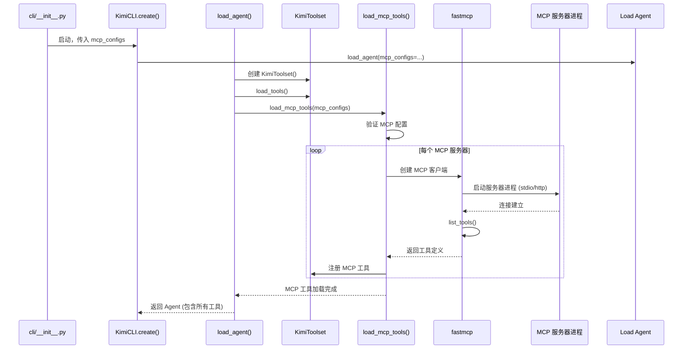

# 03 - MCP 加载机制深度解析（第 1 部分）

## 本文档说明

由于 MCP 加载机制内容较多，我将分多个部分完成：
- **第 1 部分**（本文档）：整体流程 + load_mcp_tools() 前半部分
- **第 2 部分**：load_mcp_tools() 后半部分 + MCPTool 详解
- **第 3 部分**：实际运行示例 + 调试追踪

---

## 学习目标

通过本系列文档，你将掌握：
1. MCP 工具从配置到可用的完整流程
2. `load_mcp_tools()` 的详细代码分析
3. MCP 服务器的启动和连接过程
4. MCP 工具如何被注册到 Toolset

---

## 一、MCP 加载完整流程图



---

## 二、MCP 配置来源

MCP 配置可以通过多种方式传入。

### 2.1 CLI 参数

**文件**: `src/kimi_cli/cli/__init__.py`

```python
@cli.command()
async def kimi(
    # 方式 1: 通过 --mcp-config-file 指定配置文件
    mcp_config_file: list[Path] | None = None,
    
    # 方式 2: 通过 --mcp-config 指定 JSON 配置
    mcp_config: list[str] | None = None,
):
    # ...
```

### 2.2 配置格式示例

**Stdio 服务器（本地进程）**:
```json
{
  "mcpServers": {
    "github": {
      "command": "npx",
      "args": ["-y", "github-mcp-server"],
      "env": {
        "GITHUB_TOKEN": "ghp_xxx"
      }
    }
  }
}
```

**HTTP 服务器（远程）**:
```json
{
  "mcpServers": {
    "context7": {
      "url": "https://mcp.context7.com/mcp",
      "headers": {
        "CONTEXT7_API_KEY": "ctx7sk_xxx"
      }
    }
  }
}
```

**OAuth 服务器**:
```json
{
  "mcpServers": {
    "linear": {
      "url": "https://mcp.linear.app/mcp",
      "auth": "oauth"
    }
  }
}
```

---

## 三、load_agent() 中的 MCP 加载

### 3.1 load_agent() 函数分析

**文件**: `src/kimi_cli/soul/agent.py`  
**行号**: L194-L269

```python
async def load_agent(
    agent_file: Path,
    runtime: Runtime,
    *,
    mcp_configs: list[MCPConfig] | list[dict[str, Any]],  # ← MCP 配置
) -> Agent:
    """加载 Agent，包括工具和 MCP 服务器"""
    
    logger.info("Loading agent: {agent_file}", agent_file=agent_file)
    
    # 1️⃣ 加载 Agent Spec (YAML 配置)
    agent_spec = load_agent_spec(agent_file)
    
    # 2️⃣ 加载系统提示词模板（包含 KIMI_SKILLS）
    system_prompt = _load_system_prompt(
        agent_spec.system_prompt_path,
        agent_spec.system_prompt_args,
        runtime.builtin_args,
    )
    
    # 3️⃣ 加载子代理（固定子代理）
    for subagent_name, subagent_spec in agent_spec.subagents.items():
        logger.debug("Loading subagent: {subagent_name}", subagent_name=subagent_name)
        subagent = await load_agent(
            subagent_spec.path,
            runtime.copy_for_fixed_subagent(),
            mcp_configs=mcp_configs,  # ← 子代理也会加载 MCP
        )
        runtime.labor_market.add_fixed_subagent(...)
```

**关键点 1**: 子代理递归加载，会继承相同的 MCP 配置

---

**继续**：

```python
    # 4️⃣ 创建工具集
    toolset = KimiToolset()
    
    # 5️⃣ 准备依赖注入
    tool_deps = {
        KimiToolset: toolset,
        Runtime: runtime,
        Config: runtime.config,
        Session: runtime.session,
        # ... 其他依赖 ...
    }
    
    # 6️⃣ 加载内置工具
    tools = agent_spec.tools  # 从 Agent Spec 获取
    if agent_spec.exclude_tools:
        tools = [tool for tool in tools if tool not in agent_spec.exclude_tools]
    
    toolset.load_tools(tools, tool_deps)
```

**关键点 2**: 
- `toolset.load_tools()` 只加载内置工具（file、shell、web 等）
- MCP 工具在下一步单独加载

---

**继续**：

```python
    # 7️⃣ 加载 MCP 工具
    if mcp_configs:
        # 验证 MCP 配置
        validated_mcp_configs: list[MCPConfig] = []
        from fastmcp.mcp_config import MCPConfig
        
        for mcp_config in mcp_configs:
            try:
                # 如果是字典，转换为 MCPConfig 对象
                validated_mcp_configs.append(
                    mcp_config
                    if isinstance(mcp_config, MCPConfig)
                    else MCPConfig.model_validate(mcp_config)  # ← Pydantic 验证
                )
            except pydantic.ValidationError as e:
                raise MCPConfigError(f"Invalid MCP config: {e}") from e
        
        # 🔴 调用核心函数加载 MCP 工具
        await toolset.load_mcp_tools(validated_mcp_configs, runtime)
```

**关键点 3**:
- 使用 Pydantic 严格验证配置格式
- 配置错误会立即抛出异常，阻止启动

---

**继续**：

```python
    # 8️⃣ 返回 Agent
    return Agent(
        name=agent_spec.name,
        system_prompt=system_prompt,  # ← 包含 KIMI_SKILLS
        toolset=toolset,  # ← 包含内置工具 + MCP 工具
        runtime=runtime,
    )
```

**最终 Agent 包含**：
- 系统提示词（注入了 Skills 列表）
- 内置工具 + MCP 工具的完整工具集
- Runtime（包含 Skills 字典和其他运行时信息）

---

## 四、核心函数：load_mcp_tools() 详解

### 4.1 函数签名

**文件**: `src/kimi_cli/soul/toolset.py`  
**行号**: L176-L307

```python
async def load_mcp_tools(
    self,
    mcp_configs: list[MCPConfig],
    runtime: Runtime,
    in_background: bool = True  # ← 是否后台加载
) -> None:
    """
    从 MCP 配置加载工具
    
    Args:
        mcp_configs: MCP 服务器配置列表
        runtime: Runtime 实例（用于依赖注入）
        in_background: 是否在后台加载（默认 True）
    
    Raises:
        MCPRuntimeError: 当 MCP 服务器无法连接时
    """
    import fastmcp
    from fastmcp.mcp_config import MCPConfig, RemoteMCPServer
    from kimi_cli.ui.shell.prompt import toast
```

**关键设计**：
- `in_background=True`：异步后台加载，不阻塞 Agent 启动
- 动态导入 `fastmcp`，避免必须安装 MCP 依赖

---

### 4.2 内部辅助函数

**辅助函数 1**: OAuth 令牌检查

```python
async def _check_oauth_tokens(server_url: str) -> bool:
    """检查 OAuth 令牌是否存在"""
    try:
        from fastmcp.client.auth.oauth import FileTokenStorage
        
        storage = FileTokenStorage(server_url=server_url)
        tokens = await storage.get_tokens()
        return tokens is not None  # ← True = 已授权
    except Exception:
        return False
```

**用途**: 在连接前检查 OAuth 服务器是否已授权

---

**辅助函数 2**: 显示通知

```python
def _toast_mcp(message: str) -> None:
    """显示 MCP 相关通知"""
    if in_background:
        toast(
            message,
            duration=10.0,
            topic="mcp",
            immediate=True,
            position="right",
        )
```

**用途**: 在 Shell UI 中显示 MCP 连接状态提示

---

## 五、下一步预告

在下一份文档中，我将详细讲解：

1. `_connect_server()` - 连接单个 MCP 服务器的完整流程
2. `_connect()` - 批量并行连接所有服务器
3. `MCPTool` 包装器 - 如何将 MCP 工具转换为 Kimi 工具
4. 实际运行示例和调试方法

---

**当前进度**: ✅ 基础框架完成

**请确认后，我将继续创建第 2 部分文档。**
