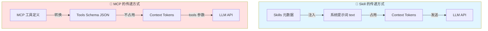
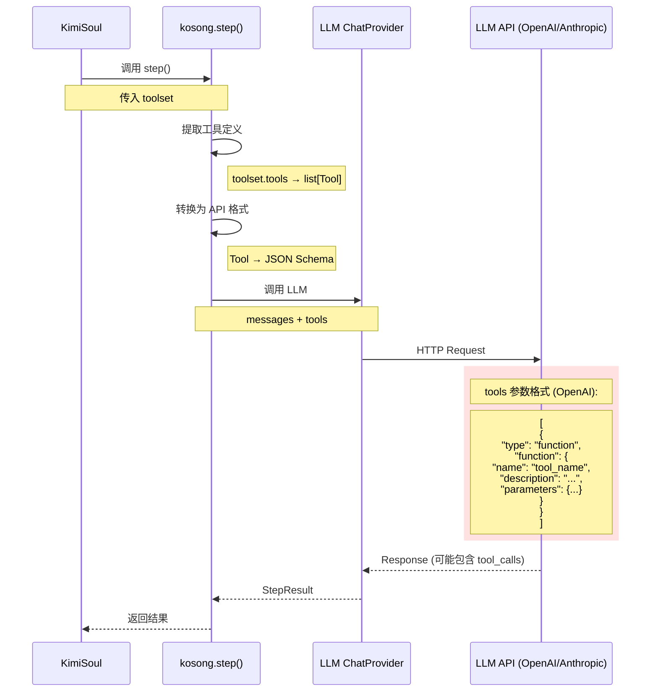

# 05 - MCP 工具信息如何传递给大模型

## 核心问题

**MCP 相关的信息会加入到提示词（或者占用大模型上下文的方式）发送给大模型吗？**

**答案**: **会，但不是通过系统提示词，而是通过 LLM API 的专门 `tools` 参数！**

---

## 一、Skill vs MCP 的传递方式对比

### 1.1 可视化对比



### 1.2 关键区别表

| 维度 | Skill | MCP 工具 |
|------|-------|----------|
| **传递位置** | 系统提示词内 | tools 参数 |
| **传递格式** | 纯文本（Markdown） | JSON Schema |
| **占用 Context** | ✅ 是（每次都占用） | ❌ 否（不计入 context tokens） |
| **可见性** | AI 在提示词中显式看到 | LLM 处理时"知道"但不在对话中 |
| **Token 成本** | 高（重复发送） | 低（仅元数据） |

---

## 二、MCP 工具如何传递给 LLM

### 2.1 完整流程图



---

### 2.2 代码追踪：从 Toolset 到 LLM API

#### 步骤 1: KimiSoul 调用 kosong.step()

**文件**: `src/kimi_cli/soul/kimisoul.py` (L387-L394)

```python
result = await kosong.step(
    chat_provider.with_thinking(self._thinking_effort),
    self._agent.system_prompt,    # ← 系统提示词（包含 Skill，不包含 MCP）
    self._agent.toolset,           # ← 工具集（包含内置 + MCP 工具）
    self._context.history,         # ← 对话历史
    on_message_part=wire_send,
    on_tool_result=wire_send,
)
```

**关键**：
- `system_prompt`: 包含 `${KIMI_SKILLS}` 的文本
- `toolset`: `KimiToolset` 实例，包含所有工具（内置 + MCP）

---

#### 步骤 2: kosong 提取工具定义

**文件**: `kosong` 库内部（简化）

```python
# kosong/step.py

async def step(
    chat_provider: ChatProvider,
    system_prompt: str,
    toolset: Toolset,
    history: list[Message],
    ...
) -> StepResult:
    # 🔴 关键：从 toolset 提取工具定义
    tools: list[Tool] = toolset.tools  # ← 调用 KimiToolset.tools 属性
    
    # 构建 LLM 请求
    response = await chat_provider.call(
        messages=[
            {"role": "system", "content": system_prompt},
            *history
        ],
        tools=tools,  # ← 工具列表
        ...
    )
```

---

#### 步骤 3: KimiToolset.tools 属性

**文件**: `src/kimi_cli/soul/toolset.py` (L87-L89)

```python
class KimiToolset:
    @property
    def tools(self) -> list[Tool]:
        """返回所有工具的定义"""
        return [tool.base for tool in self._tool_dict.values()]
```

**执行示例**：

```python
# 假设 self._tool_dict 包含:
# {
#     "read_file": FileReadTool(...),
#     "shell": ShellTool(...),
#     "github_create_issue": MCPTool(...),
#     "bigquery_query": MCPTool(...),
# }

# tools 返回:
# [
#     Tool(name="read_file", description="...", parameters={...}),
#     Tool(name="shell", description="...", parameters={...}),
#     Tool(name="github_create_issue", description="...", parameters={...}),
#     Tool(name="bigquery_query", description="...", parameters={...}),
# ]
```

**关键**：
- `tool.base` 是 `kosong.Tool` 对象
- 包含工具的元数据：name, description, parameters

---

#### 步骤 4: MCPTool 的 base 属性

**文件**: `src/kimi_cli/soul/toolset.py` (L337-L360)

```python
class MCPTool(CallableTool):
    def __init__(
        self,
        server_name: str,
        mcp_tool: mcp.Tool,  # ← 来自 MCP 服务器
        client: fastmcp.Client,
        *,
        runtime: Runtime,
        **kwargs,
    ):
        # 🔴 调用父类构造，设置工具元数据
        super().__init__(
            name=mcp_tool.name,
            description=(
                f"This is an MCP tool from MCP server `{server_name}`.\n\n"
                f"{mcp_tool.description or 'No description provided.'}"
            ),
            parameters=mcp_tool.inputSchema,  # ← JSON Schema
            **kwargs,
        )
        # ...
```

**关键**：
- `MCPTool` 继承自 `CallableTool`
- `CallableTool` 有一个 `.base` 属性，返回 `kosong.Tool`
- 这个 `Tool` 包含从 MCP 服务器获取的元数据

---

#### 步骤 5: LLM API 调用

**OpenAI API 格式**:

```json
{
  "model": "gpt-4",
  "messages": [
    {
      "role": "system",
      "content": "You are Kimi CLI...\n\n## Available skills\n- code-style\n  - Path: ...\n  - Description: ..."
    },
    {
      "role": "user",
      "content": "创建一个 GitHub Issue"
    }
  ],
  "tools": [
    {
      "type": "function",
      "function": {
        "name": "github_create_issue",
        "description": "This is an MCP tool from MCP server `github`.\n\nCreate a new issue in a repository",
        "parameters": {
          "type": "object",
          "properties": {
            "repo": {"type": "string", "description": "Repository name"},
            "title": {"type": "string", "description": "Issue title"},
            "body": {"type": "string", "description": "Issue body"}
          },
          "required": ["repo", "title"]
        }
      }
    }
  ]
}
```

**Anthropic API 格式** (类似但字段名不同):

```json
{
  "model": "claude-3-5-sonnet-20241022",
  "system": "You are Kimi CLI...\n\n## Available skills\n- code-style\n  - Path: ...",
  "messages": [...],
  "tools": [
    {
      "name": "github_create_issue",
      "description": "This is an MCP tool from MCP server `github`.\n\nCreate a new issue...",
      "input_schema": {
        "type": "object",
        "properties": {...},
        "required": [...]
      }
    }
  ]
}
```

---

## 三、Context Tokens 分析

### 3.1 Skill 的 Token 消耗

**示例系统提示词片段**:

```markdown
## Available skills

- code-style
  - Path: /home/user/.kimi/skills/code-style/SKILL.md
  - Description: 项目代码风格指南
- git-commits
  - Path: /home/user/.kimi/skills/git-commits/SKILL.md
  - Description: Git 提交消息规范使用 Conventional Commits 格式
- bigquery-analysis
  - Path: /home/user/.kimi/skills/bigquery-analysis/SKILL.md
  - Description: BigQuery 数据分析工作流，包括查询设计、数据处理和可视化
```

**Token 估算**:
- 每个 Skill: ~50-100 tokens（名称 + 路径 + 描述）
- 5 个 Skills: ~250-500 tokens
- **每次 LLM 调用都会消耗这些 tokens**

---

### 3.2 MCP 工具的 Token 消耗

**MCP 工具定义不计入 context tokens！**

它们通过 `tools` 参数传递，这是 LLM API 的特殊字段，不占用对话上下文。

**但是**：
- LLM 返回的 **tool_calls** 会计入 tokens
- 工具执行的 **结果** 会追加到对话历史，计入 tokens

**示例**:

```python
# LLM 返回
{
    "tool_calls": [
        {
            "id": "call_123",
            "function": {
                "name": "github_create_issue",
                "arguments": '{"repo": "user/repo", "title": "..."}'
            }
        }
    ]
}

# 这个 tool_call 会占用 ~100 tokens

# 工具执行后的结果
{
    "role": "tool",
    "tool_call_id": "call_123",
    "content": "Issue created: https://github.com/user/repo/issues/123"
}

# 这个结果会占用 ~50 tokens
```

---

### 3.3 对比总结

| 项目 | Skill | MCP 工具 |
|------|-------|----------|
| **元数据在系统提示词** | ✅ 是（每次都发送） | ❌ 否 |
| **元数据在 tools 参数** | ❌ 否 | ✅ 是 |
| **元数据占用 context** | ✅ 是 | ❌ 否 |
| **调用记录占用 context** | ✅ 是（读取 SKILL.md） | ✅ 是（tool_call + 结果） |

---

## 四、为什么这样设计？

### 4.1 Skill 放在系统提示词的原因

✅ **优点**：
- AI 可以**主动看到** Skills 列表
- AI 可以**自主决定**何时读取哪个 Skill
- 用户可以通过系统提示词**理解** AI 知道哪些 Skills

❌ **缺点**：
- 每次调用都消耗 tokens
- Skills 多了会占用大量上下文

**设计意图**：Skill 是**知识注入**，需要 AI 主动感知和选择

---

### 4.2 MCP 放在 tools 参数的原因

✅ **优点**：
- 不占用宝贵的 context tokens
- LLM 可以看到所有可用工具
- 工具定义可以很详细（复杂的 JSON Schema）

❌ **缺点**：
- AI 无法在系统提示词中"看到"工具列表
- 需要 LLM 支持 function calling 功能

**设计意图**：MCP 是**能力赋予**，通过标准的 function calling 机制提供

---

## 五、实际示例对比

### 5.1 场景：AI 需要读取 Skill

**用户输入**: "帮我创建一个符合规范的 Git 提交"

**LLM 请求**:

```json
{
  "messages": [
    {
      "role": "system",
      "content": "...\n## Available skills\n- git-commits\n  - Path: ...\n  - Description: Git 提交消息规范使用 Conventional Commits 格式\n..."
    },
    {
      "role": "user",
      "content": "帮我创建一个符合规范的 Git 提交"
    }
  ],
  "tools": [...]
}
```

**LLM 响应**:

```json
{
  "tool_calls": [
    {
      "function": {
        "name": "read_file",
        "arguments": "{\"path\": \"/home/user/.kimi/skills/git-commits/SKILL.md\"}"
      }
    }
  ]
}
```

**关键**：
- AI 从系统提示词中**看到** `git-commits` Skill
- AI **决定**读取它
- 使用普通的 `read_file` 工具（不是专门的 Skill 工具）

---

### 5.2 场景：AI 需要调用 MCP 工具

**用户输入**: "在 GitHub 创建一个 Issue: 修复登录 bug"

**LLM 请求**:

```json
{
  "messages": [
    {
      "role": "system",
      "content": "..."
    },
    {
      "role": "user",
      "content": "在 GitHub 创建一个 Issue: 修复登录 bug"
    }
  ],
  "tools": [
    {
      "type": "function",
      "function": {
        "name": "github_create_issue",
        "description": "This is an MCP tool from MCP server `github`.\n\nCreate a new issue in a GitHub repository",
        "parameters": {
          "type": "object",
          "properties": {
            "repo": {"type": "string"},
            "title": {"type": "string"},
            "body": {"type": "string"}
          },
          "required": ["repo", "title"]
        }
      }
    }
  ]
}
```

**LLM 响应**:

```json
{
  "tool_calls": [
    {
      "function": {
        "name": "github_create_issue",
        "arguments": "{\"repo\": \"user/repo\", \"title\": \"修复登录 bug\", \"body\": \"...\"}"
      }
    }
  ]
}
```

**关键**：
- AI **没有在系统提示词中看到** MCP 工具列表
- 但 LLM 通过 `tools` 参数**知道**有 `github_create_issue` 工具
- AI 可以**直接调用**它

---

## 六、深入：LLM 如何"看到" tools 参数

### 6.1 LLM 的 Function Calling 机制

现代 LLM（OpenAI GPT-4, Anthropic Claude, 等）都支持 **Function Calling**：

1. **训练时**：LLM 被训练理解工具定义（JSON Schema）
2. **推理时**：LLM 看到 `tools` 参数，知道有哪些工具可用
3. **决策时**：LLM 决定是否调用工具，以及传什么参数
4. **输出时**：LLM 输出 `tool_calls` JSON（而不是纯文本）

**这与普通的对话不同**：
- 普通对话：LLM 只看 `messages`
- Function Calling：LLM 看 `messages` + `tools`

---

### 6.2 tools 参数的"可见性"

**问题**: 既然 tools 不在 messages 中，AI 怎么知道有哪些工具？

**答案**: 
- `tools` 参数是 LLM API 的**特殊字段**
- LLM 在处理请求时，会将 `tools` 信息**内部注入**到推理过程中
- 这类似于"给 LLM 一个工具箱"，LLM 知道箱子里有什么工具

**类比**:
```
普通对话 = 给 AI 一本书（messages）
Function Calling = 给 AI 一本书（messages）+ 一个工具箱（tools）
```

AI 可以：
- 阅读书（messages）
- 查看工具箱里有什么（tools）
- 决定使用哪个工具

---

## 七、总结

### 7.1 核心回答

**MCP 工具信息会占用大模型上下文吗？**

**答案分两部分**：

1. **工具定义（元数据）**：
   - ❌ **不占用** context tokens
   - ✅ 通过 `tools` 参数传递
   - ✅ LLM 可以"看到"并使用

2. **工具调用和结果**：
   - ✅ **占用** context tokens
   - ✅ tool_calls 和 tool results 会追加到对话历史

---

### 7.2 与 Skill 的对比

| 内容 | Skill | MCP |
|------|-------|-----|
| **元数据传递** | 系统提示词 | tools 参数 |
| **元数据占用 tokens** | ✅ 是 | ❌ 否 |
| **AI 主动可见** | ✅ 是 | ⚠️ 部分（通过 tools） |
| **调用占用 tokens** | ✅ 是 | ✅ 是 |

---

### 7.3 设计哲学

**Skill**:
- 知识需要被**主动感知**
- 放在系统提示词中，AI 可以**看到并选择**
- Token 成本是合理的（知识注入）

**MCP**:
- 工具需要被**随时调用**
- 通过 tools 参数，**不占用对话上下文**
- 只有调用和结果占用 tokens（按需消耗）

---

## 八、扩展思考

### 思考 1: 如果 MCP 工具很多怎么办？

**问题**: 100 个 MCP 工具的定义会不会很大？

**答案**: 
- `tools` 参数有大小限制（取决于 LLM 提供商）
- OpenAI: 最多 128 个工具
- Anthropic: 类似限制

**解决方案**:
- 按需加载工具（Agent Spec 指定需要的 MCP 服务器）
- 动态工具选择（未来可能的优化）

---

### 思考 2: 能否将 Skill 也用 tools 参数传递？

**技术上可行**:
- 可以为每个 Skill 创建一个"读取 Skill"工具
- 工具名: `read_skill_code_style`
- 工具描述: Skill 的 description

**但不这样做的原因**:
- Skill 是**知识**，需要 AI **主动感知和选择**
- 工具是**能力**，AI **按需调用**
- 两者的**交互模式**不同

---

**文档状态**: ✅ 已完成  
**关键要点**: MCP 工具定义通过 tools 参数传递，不占用 context tokens！
