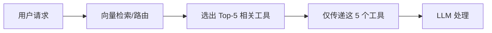

# 06 - 重要勘误：MCP 工具定义与 Context Window

## ⚠️ 勘误声明

在之前的文档（特别是 **05-MCP工具信息如何传递给大模型.md**）中，我对 MCP 工具定义是否占用 Context Window 的说法**存在错误**。

---

## 🔴 错误的说法

❌ **之前错误的理解**：
> "MCP 工具定义通过 `tools` 参数传递，**不占用 context tokens**"

---

## ✅ 正确的理解

**正确答案：tools 参数的工具定义依然会占用 Context Window，并计入 Input Tokens 费用。**

### 核心原理

1. **LLM 必须"读到"工具定义**
   - LLM 本质是文本补全模型
   - 必须在上下文中看到工具的名称、描述、参数
   - 才能知道何时、如何调用工具

2. **tools 参数的处理方式**
   - API 后台会将 `tools` 参数**注入到 System Prompt** 或特定上下文区域
   - 这些 JSON Schema 会被转换为 tokens
   - 占用模型的 Context Window

3. **Token 消耗**
   ```
   Total Input Tokens = 
       System Prompt Tokens +
       Conversation History Tokens +
       Tools Definition Tokens ←  这部分会占用！
   ```

---

## 📊 正确的对比表

| 维度 | Skill | MCP 工具 |
|------|-------|----------|
| **传递位置** | 系统提示词内 | `tools` 参数（后台注入系统提示词）|
| **传递格式** | Markdown 文本 | JSON Schema |
| **占用 Context** | ✅ 是 | ✅ **是**（之前错误地说"否"）|
| **计入费用** | ✅ 是 | ✅ **是** |
| **优化方式** | 减少 Skills 数量 | Prompt Caching / 动态加载 |

---

## 🔍 深入理解

### 1. 为什么 tools 参数也占用 Context？

虽然在代码层面 `tools` 是独立参数：

```python
response = llm_api.call(
    messages=[...],
    tools=[...]  # 看起来是独立的
)
```

但在 LLM 处理层面：

```
实际上下文 = 
    [System Prompt]
    + [Tools 定义被注入到这里]  ← 关键！
    + [User Message]
    + [Assistant Message]
    + ...
```

**LLM 看到的可能是**：

```markdown
System: You are Kimi CLI...

[TOOLS AVAILABLE]
- Tool: github_create_issue
  Description: Create a new GitHub issue
  Parameters: {
    "repo": "string",
    "title": "string",
    ...
  }
- Tool: bigquery_query
  Description: Execute BigQuery SQL
  Parameters: {...}
...

User: 创建一个 GitHub Issue
```

所有这些都在 Context Window 内！

---

### 2. MCP 的真正作用

**MCP 并没有解决 Context Window 的问题！**

MCP 的价值在于：
- ✅ **标准化工具连接协议**（统一接口）
- ✅ **简化工具集成**（连接数据库、文件系统等）
- ✅ **动态工具发现**（自动获取工具列表）

但对于 LLM 来说：
- MCP 工具 = 普通的 function definitions
- 都是纯文本 tokens
- 都占用 Context Window

---

### 3. Token 消耗示例

**假设有 50 个 MCP 工具**，每个工具定义平均 200 tokens：

```
Tools Definition Tokens = 50 × 200 = 10,000 tokens
```

如果你的模型 Context Window 是 128k：
- 工具定义直接占用了 **7.8%** 的上下文
- 这还没算系统提示词和对话历史

---

## ⚡ 优化策略

### 策略 1: Prompt Caching（最有效）

**支持的提供商**：
- ✅ Anthropic Claude
- ✅ OpenAI (部分模型)

**原理**：
- 将工具定义标记为可缓存
- 首次请求：正常计费
- 后续请求：如果工具定义未变，大幅降低费用（约 90% 折扣）

**效果**：
- ✅ **仍然占用 Context Window**（需要大窗口模型）
- ✅ **不重复计费**（省钱）
- ✅ **降低延迟**（提速）

**Kimi CLI 中的应用**：

查看 kosong 或 anthropic client 相关代码，可能已经支持 Prompt Caching。

---

### 策略 2: 动态工具加载 / RAG for Tools

**原理**：
- 不一次性传递所有工具
- 根据用户请求，智能选择最相关的 N 个工具

**流程**：



**优势**：
- ✅ 大幅减少 Context 占用
- ✅ 降低费用
- ✅ 适合工具数量多的场景（100+ 工具）

**实现思路**：

```python
def select_relevant_tools(user_query: str, all_tools: list[Tool], top_k=5) -> list[Tool]:
    """使用向量相似度选择最相关的工具"""
    
    # 1. 将用户查询向量化
    query_embedding = embed(user_query)
    
    # 2. 计算每个工具的相关性
    tool_scores = []
    for tool in all_tools:
        tool_text = f"{tool.name} {tool.description}"
        tool_embedding = embed(tool_text)
        similarity = cosine_similarity(query_embedding, tool_embedding)
        tool_scores.append((tool, similarity))
    
    # 3. 返回 Top-K
    tool_scores.sort(key=lambda x: x[1], reverse=True)
    return [tool for tool, _ in tool_scores[:top_k]]
```

---

### 策略 3: 精简工具定义

**优化前**：

```json
{
  "name": "github_create_issue",
  "description": "This is an MCP tool from MCP server `github`.\n\nCreate a new issue in a GitHub repository. This tool allows you to create issues with titles, bodies, labels, assignees, and milestones. It supports markdown formatting in the issue body and can handle multiple labels and assignees at once.",
  "parameters": {
    "type": "object",
    "properties": {
      "repo": {
        "type": "string",
        "description": "The full repository name in the format 'owner/repo', for example 'microsoft/vscode' or 'facebook/react'"
      },
      // 更多冗长的描述...
    }
  }
}
```

**Token 估算**: ~300 tokens

---

**优化后**：

```json
{
  "name": "github_create_issue",
  "description": "Create GitHub issue",
  "parameters": {
    "type": "object",
    "properties": {
      "repo": {"type": "string", "description": "owner/repo"},
      "title": {"type": "string"},
      "body": {"type": "string"}
    },
    "required": ["repo", "title"]
  }
}
```

**Token 估算**: ~80 tokens

**节省**: 73% tokens！

---

## 🔄 更正之前的文档

### 需要更正的关键点

**文档 04** 和 **文档 05** 中的以下说法需要更正：

❌ **错误**:
> "MCP 工具定义不计入 context tokens"

✅ **正确**:
> "MCP 工具定义会占用 Context Window 并计入 Input Tokens，但可以通过 Prompt Caching 优化"

---

❌ **错误**:
> "MCP: 不占用 Context Tokens"

✅ **正确**:
> "MCP: 占用 Context Tokens（工具定义），但可缓存"

---

## 💡 重新理解 Skill vs MCP

### 更新后的对比

| 维度 | Skill | MCP 工具 |
|------|-------|----------|
| **传递方式** | 显式在系统提示词 | tools 参数（隐式注入）|
| **占用 Context** | ✅ 是 | ✅ **是** |
| **可见性** | AI 主动看到 | LLM 知道但不在对话中 |
| **优化方式** | 减少数量 | Prompt Caching / 动态加载 |
| **适用场景** | 知识、规范、流程 | 工具、能力、API 调用 |

### 本质差异

虽然都占用 Context，但：

**Skill**:
- 显式列出，AI 可以"看到"并选择
- 数量通常较少（几个到十几个）
- 需要 AI 主动读取完整内容

**MCP**:
- 隐式注入，LLM 知道但用户看不到
- 数量可能很多（几十到上百个）
- 只有被调用时才执行

---

## 📝 总结

### 核心真相

1. ✅ **tools 参数会占用 Context Window**
2. ✅ **会计入 Input Tokens 费用**
3. ✅ **Prompt Caching 可以优化成本**（但仍占用窗口）
4. ✅ **动态工具选择是长期解决方案**

### 设计建议

如果你在 Kimi CLI 中挂载了很多 MCP Servers：

1. **短期**: 只加载真正需要的 MCP 工具
2. **中期**: 启用 Prompt Caching（如果 LLM 提供商支持）
3. **长期**: 实现动态工具路由/检索系统

---

## 🙏 致歉

感谢你的指正！这是一个非常重要的概念澄清。我之前的理解基于对"独立参数"的表面理解，但忽略了 LLM 的底层工作原理。

**教训**: 在分布式系统和 AI 领域，"看起来独立的参数"在底层实现中往往会被合并处理。

---

**文档状态**: ✅ 勘误完成  
**受影响文档**: 04, 05  
**建议**: 重点阅读本文档，理解正确的 Context Window 机制
